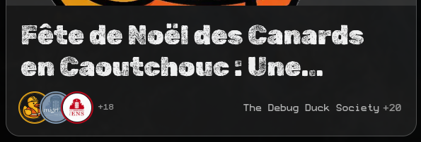
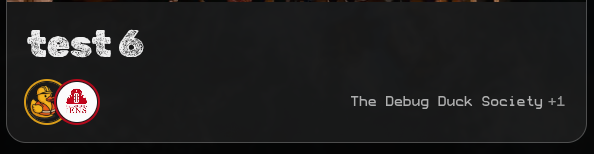

# Articles (Directus) — Guide de saisie pour les organisateur·ices

Cette page explique **quoi remplir**, **dans quel ordre**, et **à quoi servent** les champs d’un **Article** dans le CMS Directus.

---

## ⚠️ Important (changement de modèle à venir)

- Le champ **Collective** va être **supprimé** dans une prochaine version.
- À terme, on utilisera **uniquement “Editors”** pour gérer les organisations liées à un article.

👉 **Dès maintenant**, considérez **Editors** comme le champ de référence.

---

## Règles d’accès et d’édition (à retenir)

### Editors = organisations qui peuvent modifier l’article

- **Editors doit contenir au moins 1 organisation.**
- **Toute organisation ajoutée à Editors pourra modifier l’article** (droits d’édition).

### L’organisation créatrice garde toujours l’accès

- L’organisation qui **crée** un article **aura toujours accès à l’article**, **même si elle est retirée** de la liste **Editors** par la suite.
- Donc : retirer une organisation des Editors **n’enlève pas** forcément l’accès si c’est l’organisation créatrice.

---

## Langues (Translations)

- **Le français est obligatoire.**
- **L’anglais est fortement recommandé.**
- L’interface **ouvre et privilégie le français par défaut** (UI default = FR), donc pensez à :
  - compléter **FR** en premier,
  - puis ajouter / compléter **EN** si possible.

---

## Vue d’ensemble : les champs que vous allez utiliser

### Champs principaux (à remplir)

- **Status** _(statut de publication)_
- **Published At** _(date/heure de publication)_
- **Tag** _(catégorie)_
- **Editors** _(organisations associées / co-édition + droits de modification)_
- **Cover** _(image de couverture)_
- **Translations** _(FR obligatoire, EN recommandé)_
- **Events** _(facultatif : événements liés)_

### Champ en cours de retrait

- **Collective** _(sera retiré dans une prochaine version — ignorez si possible)_

### Champs automatiques (vous n’y touchez pas)

- **ID**
- **User Created / Date Created**
- **User Updated / Date Updated**

---

## Workflow recommandé (ordre de remplissage)

1. **Editors** (au moins 1 organisation — la/les orga(s) qui doivent pouvoir modifier)
2. **Tag** (catégorie)
3. **Cover** (image)
4. **Translations**
   - FR (obligatoire)
   - EN (recommandé)
5. **Published At** (date/heure)
6. **Status** → passer à **Published** quand tout est prêt
7. _(optionnel)_ **Events** (lier l’article à un ou plusieurs événements)

> **Note sur “Collective” :** si le champ existe encore dans votre interface, remplissez-le si le système l’exige, mais il sera retiré prochainement.

## Astuce : enregistrer même si un champ obligatoire bloque

Si vous voulez **sauvegarder votre travail** mais qu’un **champ obligatoire** vous empêche d’enregistrer (par exemple une image, un tag, ou un éditeur), vous pouvez :

1. Mettre **une valeur provisoire** (n’importe laquelle) dans le champ bloquant
2. Vérifier que **Status = `draft`** (brouillon)
3. Sauvegarder, puis revenir plus tard pour remplacer la valeur provisoire par la bonne

> Important : laissez l’article en **draft** tant que les champs obligatoires ne sont pas correctement remplis.

---

## Détail champ par champ

### Editors (organisations éditrices)

**Où :** champ “Editors”  
**Obligatoire :** ✅ Oui (au moins 1)  
**Rôle :**

- Liste des organisations associées à l’article.
- **Contrôle l’accès en modification** : toute organisation ajoutée ici pourra **éditer** l’article.
- **Affichage sur le site :**
  - Sur la page **“Tous les articles”** (cartes / _article cards_), on affiche :
    - les **3 premières** organisations de la liste **Editors**
    - et le **nom de la première organisation** ajoutée (comme organisation principale affichée sur la carte)
    - 
    - 
  - Sur la **page de l’article**, **toutes** les organisations de **Editors** seront affichées.

**Règles :**

- Il doit y avoir **au moins une organisation** dans Editors.
- Ajouter une organisation = lui donner l’accès en édition.
- L’organisation qui a créé l’article conserve l’accès même si elle est retirée des Editors.

**Conseils :**

- Mettez votre organisation en **première** dans Editors si vous voulez qu’elle apparaisse comme principale sur la carte.
- Gardez la liste **Editors** propre et dans le bon ordre (surtout les 3 premières).
- Ajoutez les co-organisateurs / partenaires qui doivent pouvoir contribuer au texte.

---
