# Articles

Ce guide explique **quoi remplir**, **dans quel ordre**, et **à quoi servent** les champs d’un **Article** dans le CMS Directus.  
Objectif : vous permettre de **publier vite**, sans oublier l’essentiel, et de comprendre **qui peut éditer quoi**.

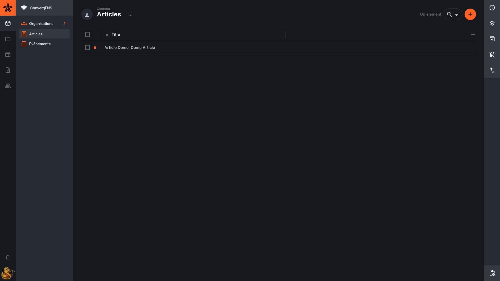

<!-- prettier-ignore-start -->

- TOC
{:toc}
<!-- prettier-ignore-end -->

## Où trouver les articles ?

Dans l’éditeur du site : **Contenu → articles**.

Vous pouvez aussi y accéder depuis un **événement**, via le champ **Articles associés** (sélection / liaison d’articles).

Vous verrez la liste des articles (avec filtres). En ouvrant un article, vous accédez à tous ses champs pour le compléter et le publier.

Pour créer un nouvel article, cliquez sur le gros bouton « + » « Créer un élément ».

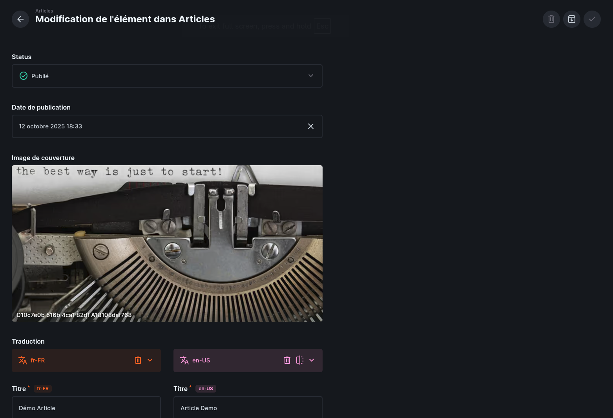

# À remplir en priorité (obligatoire)

✅ = obligatoire

> Objectif : en remplissant cette partie, vous pouvez déjà **enregistrer** et revenir plus tard.

## Statut ✅

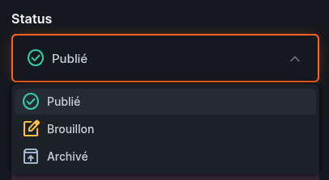

- **Nom dans l'éditeur du site** : `status`
- **À quoi ça sert** : décide si l’organisation est visible sur le site.
- **Valeurs** : `published` / `draft` / `archived`

Bon réflexe :

- laissez en **draft** (brouillon) tant que l’organisation n’est pas prête
- passez en **published** (publié) quand elle doit apparaître sur le site
- utilisez **archived** (archivé) pour la retirer sans la supprimer

---

## Date de publication

- **Nom dans l'éditeur du site** : `published_at` (champ “Published At”)
- **À quoi ça sert** : définit la **date affichée** et/ou l’**ordre de tri** des articles.
- **Comment le remplir** :
  - publication immédiate : date/heure actuelle
  - publication planifiée : date future (selon le comportement du site)
- **Conseil** : si votre article n’apparaît pas, vérifiez que la date n’est pas **dans le futur**.

---

## Catégorie (Tag) ✅

- **Nom dans l'éditeur du site** : `tag` (champ “Tag”)
- **À quoi ça sert** : classe l’article dans une **catégorie** (tri, affichage, navigation).
- **Comment le remplir** :
  - choisir une catégorie dans la liste déroulante
  - (création de tag depuis l’article : **désactivée**)
- **Exemple** : `Tag = Actualités` / `Tag = Événements`
- **Conseil** : si vous hésitez, choisissez le tag le plus utile pour quelqu’un qui “tombe” sur l’article.
  > Vous pouvez demander l'ajout de nouvelles tags auprès de l'administrateur du site ou du webmaster.

---

## Image de couverture ✅

- **Nom dans l'éditeur du site** : `cover` (champ “Cover”)
- **À quoi ça sert** : image affichée sur la **carte article** et/ou en **en-tête**.
- **Comment le remplir** :
  - importer/choisir une image lisible
  - privilégier un format **paysage** et adapté mobile
- **Exemple** : photo d’événement, visuel d’annonce, image simple et contrastée
  
  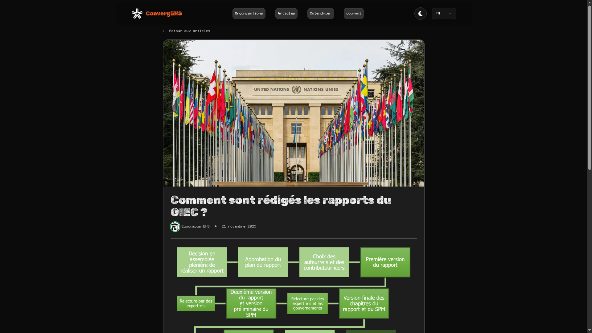

---

## Traduction ✅

- **Nom dans l'éditeur du site** : `translations` (bloc “Translations”)
- **À quoi ça sert** : contenu multilingue de l’article (**FR obligatoire**, **EN recommandé**).
- **Comment le remplir** :
  - compléter **FR d’abord** (l’interface privilégie FR)
  - ajouter / compléter **EN** si possible
- **Exemple** : FR complet (titre + corps), EN version courte si vous manquez de temps
- **Conseil** : aérez le corps (paragraphes, intertitres, listes, liens).
- **FR obligatoire**, **EN fortement recommandé**
- Remplir **FR d’abord**, puis **EN**

> L’UI ouvre et privilégie le français par défaut : vérifiez bien que l’onglet FR est complet.

## Titre

- **Nom dans l'éditeur du site** : `translations.title` (champ “Title” dans Translations)
- **Où ça s’affiche** : titres de pages + cartes / listes
- **Longueur** : court, clair, informatif
- **Exemple** : “Rencontre ConvergENS — janvier 2026 : programme et inscriptions”

## Contenu

- **Nom dans l'éditeur du site** : `translations.body` (champ “Body” dans Translations)
- **Où ça s’affiche** : page détaillée de l’article
- **Vous pouvez** : titres, listes, liens, images  
  ➡️ Voir : **[Guide éditeur de texte](wysisyg.html)**

> Astuce : supprimez les phrases ajoutées par DeepL/IA du type “Voici la traduction…”.

---

## Auteurs ✅

- **Nom dans l’éditeur du site** : `editors` (champ “Auteurs”)
- **À quoi ça sert** : définit **quelles organisations peuvent modifier l’article** et **quelles organisations s’affichent** sur le site comme auteur.
- **Comment le remplir** :
  - ajouter **au moins 1 organisation**
  - mettre votre organisation **en 1re** si vous voulez qu’elle apparaisse comme organisation “principale” sur la carte
  - garder un ordre clair : les **3 premières** sont celles affichées sur les cartes
- **Exemple** : `Auteurs = [The Debug Duck Society, Organisation partenaire, Co-organisation]`
- **Conseil** : n’ajoutez que les organisations qui doivent réellement **avoir les droits d’édition**.

> Si vous ne voyez que votre organisation et que vous voulez ajouter des co-auteurs, vérifiez que vous n’avez pas de **filtres/tags** actifs dans la liste.

**Où ça s’affiche** :

- sur **Tous les articles** : les **3 premières** organisations, avec le nom de la **1re** mis en avant
- sur la **page article** : **toutes** les organisations listées dans Auteurs

### Un auteur

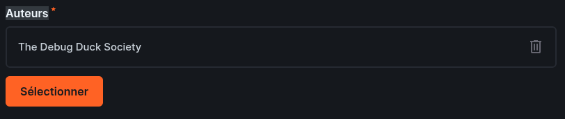
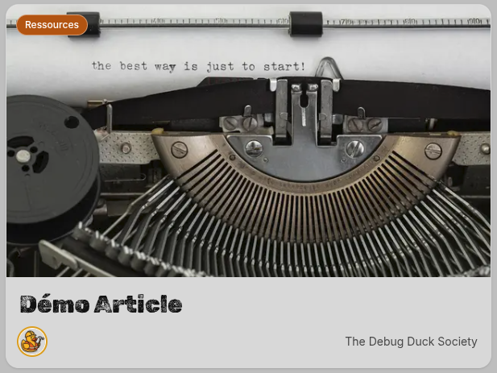
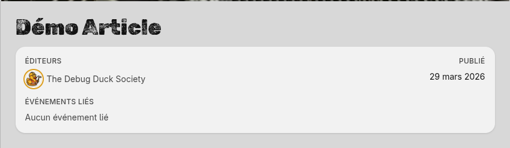

### Deux auteur

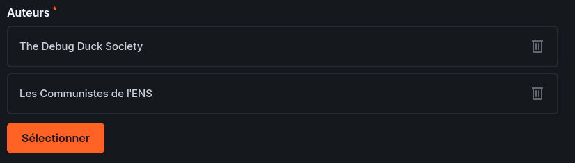
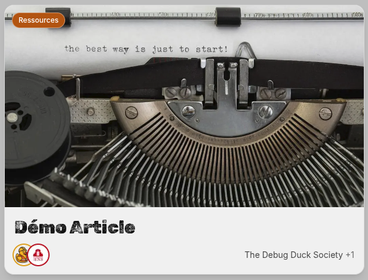
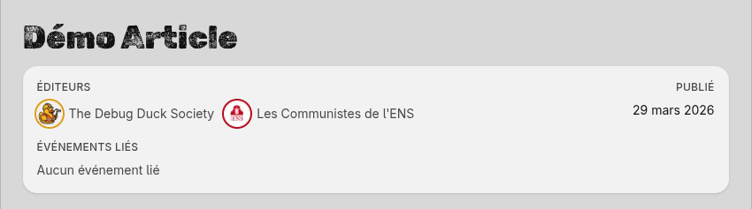

### Plusieurs auteur

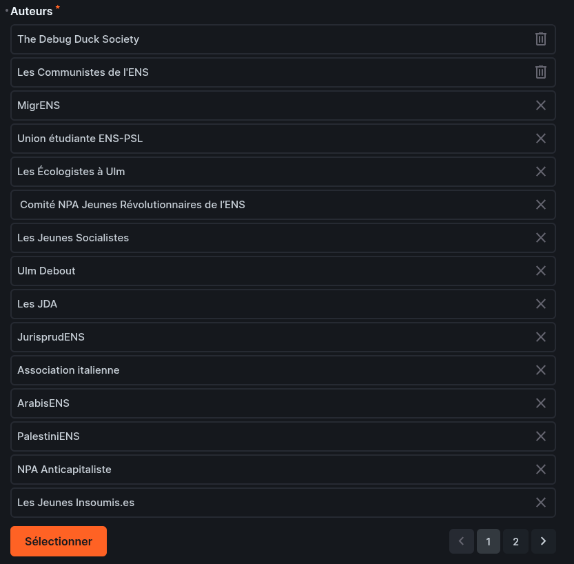
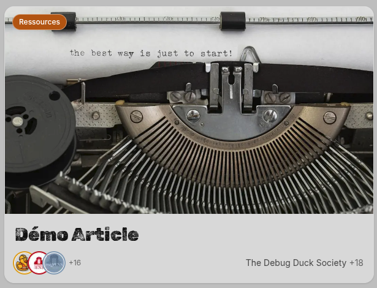
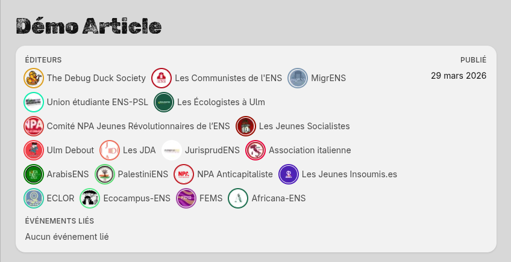

---

### À retenir

- **Obligatoire** : Auteurs doit contenir **au moins 1 organisation**.
- **Droits** : toute organisation ajoutée dans Auteurs peut **modifier** l’article.
- **Accès** : l’organisation qui **a créé** l’article garde l’accès **même si elle est retirée** des Auteurs.

---

# Options (facultatif)

## Événements

- **Nom dans l'éditeur du site** : `events` (champ “Events”)
- **À quoi ça sert** : relier l’article à un ou plusieurs événements (annonce, compte-rendu, etc.).
- **Quand le remplir** : si l’article concerne clairement un événement.

### **Créer ou sélectionner un événement :**

- Cliquez sur **New** pour créer un nouvel événement.
- Si l’événement existe déjà, cliquez sur **Select** pour le choisir.
- Pour plus de détails, voir : **[Guide des événements](events.html)**.

---

# Procédure pas à pas

1. Aller dans **Contenu → articles**
2. Cliquer sur **Créer** (ou ouvrir un article existant)
3. Remplir d’abord : **Organisations éditrices ✅**, **Catégorie ✅**, **Image de couverture ✅**, **Traductions (FR) ✅**
4. Compléter ensuite : **Date de publication**, puis relire
5. Passer **Statut → Publié** quand c’est prêt
6. (Optionnel) Ajouter **Événements liés** si pertinent

## Astuce : enregistrer même si un champ obligatoire bloque

Si vous voulez **sauvegarder** mais qu’un champ obligatoire bloque :

1. Mettre **une valeur provisoire** dans le champ bloquant
2. Vérifier que **Statut = Brouillon**
3. Sauvegarder, puis revenir plus tard corriger

> Important : laissez l’article en **Brouillon** tant que les champs obligatoires ne sont pas correctement remplis.

---

# Checklist avant publication

Avant de passer **Statut → Publié**, vérifiez :

- [ ] **Organisations éditrices** contient au moins 1 organisation (et les bonnes)
- [ ] **Catégorie** est choisie
- [ ] **Image de couverture** est ajoutée et correcte
- [ ] **Traductions (FR)** : titre + contenu complets
- [ ] **Traductions (EN)** : ajoutées si possible (fortement recommandé)
- [ ] **Date de publication** est cohérente
- [ ] (optionnel) **Événements liés** ajoutés si pertinent

---

# Dépannage rapide

## “Une autre organisation doit pouvoir modifier l’article”

➡️ Ajoutez-la dans **Organisations éditrices**.

## “Je veux retirer l’accès en modification à une organisation”

➡️ Retirez-la de **Organisations éditrices** (sauf si c’est l’organisation créatrice : elle gardera l’accès).

## “Mon article n’apparaît pas sur le site”

- Vérifiez **Statut = Publié**
- Vérifiez **Date de publication** (pas une date future si le site filtre)
- Vérifiez que **Image de couverture + Catégorie + Traductions (FR)** sont bien remplis

## “Je n’arrive pas à enregistrer”

- champ obligatoire manquant (**Organisations éditrices / Catégorie / Image de couverture / Traductions (FR)**)
- valeur provisoire possible → gardez **Statut = Brouillon** (voir astuce plus haut)
