# Comprendre L'Éditeur — les bases

Bienvenue dans L'Éditeur 🧭  
C’est un peu **la salle des commandes** du site : vous appuyez sur les bons boutons, et _hop_, le site se met à jour. Promis, pas besoin d’être informaticien·ne — on va y aller tranquillement, étape par étape 🙂

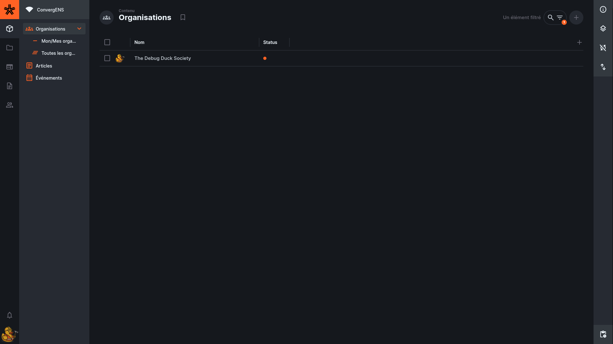

L'Éditeur est l’éditeur (CMS) qui permet de **créer**, **modifier** et **publier** le contenu de ConvergENS (détais de l'organisations, articles, événements…).  
Tout ce que vous changez ici peut ensuite apparaître sur le site, **à condition de publier**.

<!-- prettier-ignore-start -->

- TOC
{:toc}
<!-- prettier-ignore-end -->

## La barre de navigation (à gauche)

Dans l’éditeur, tout à gauche, vous verrez une barre avec **5 icônes**.  
Elles servent à aller dans les grandes sections de L'Éditeur.

- 📦 Contenu (On dirait une boîte)
- 📁 Fichiers (Un dossier.)
- 🌐 Raccourcis Site web (Front)
- 📄 Raccourcis Documentation
- 👥 Utilisateurs

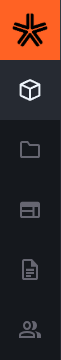

### 📦 Contenu (On dirait une boîte)

C’est **l’endroit principal** : vous y gérez tout ce qui est publié sur le site, par exemple :

- organisations
- articles
- événements

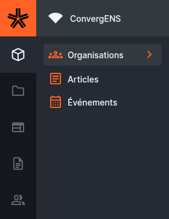

👉 Si vous ne savez pas où aller, c’est presque toujours ici.

### 📁 Fichiers (Un dossier.)

C’est la **bibliothèque d’images et de documents** (logos, affiches, images d’articles, PDF…).  
Vous pouvez y retrouver un fichier déjà envoyé, ou en ajouter un nouveau.

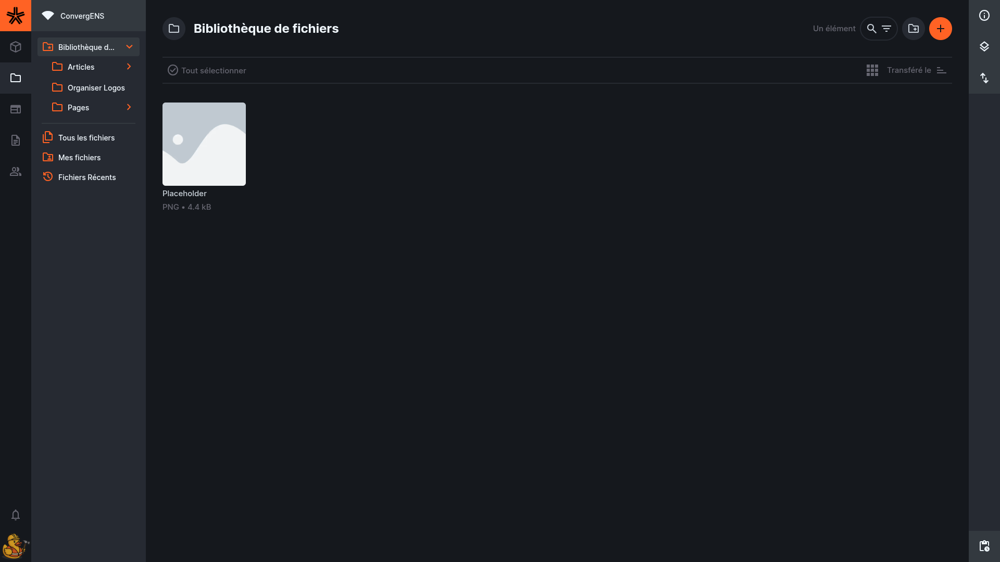

### 🔗 Raccourcis (liens utiles)

Dans notre instance, il y a aussi deux liens personnalisés :

- **🌐 Site web (Front)** : ouvre le **site public**, celui que tout le monde voit.
- **📄 Documentation** : ouvre **ce guide** (la page où vous êtes en ce moment).

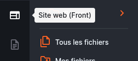

> Astuce : si vous avez un doute sur “ce que ça rend sur le site”, le lien **Site web (Front)** permet de vérifier rapidement.

### 👥 Utilisateurs

C’est la liste des comptes qui peuvent accéder à l’éditeur.  
⚠️ Cette section est souvent réservée aux personnes qui gèrent l’administration.
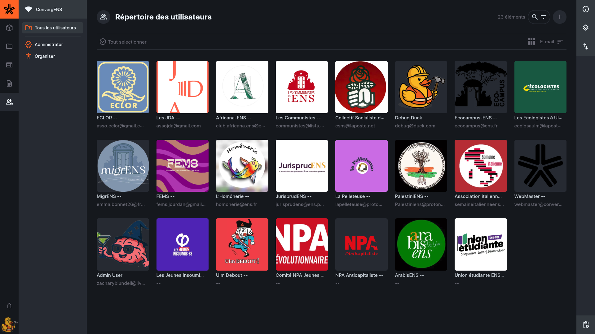

# Les sections dans **Contenu**

Quand vous cliquez sur **📦 Contenu**, vous voyez une liste de rubriques (comme sur la capture).  
Chaque rubrique correspond à un “type de contenu” du site.

> Les petites flèches **▸ / ▾** indiquent qu’il y a des sous-menus (comme pour **Organisations**).
> 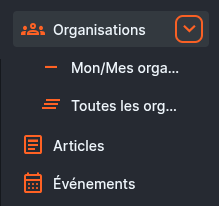

## 🏷️ Organisations (Organisations)

Cette rubrique sert à gérer la **page d’une organisation** (nom, logo, couleur, contacts, description…).

Elle a deux sous-sections :

### 🔖 Mon Organisation

C’est votre **fiche organisation** (celle dont vous faites partie).  
👉 C’est l’endroit le plus simple pour mettre à jour votre logo, description, liens, etc.

### 📚 Toutes les organisations…

La liste de **toutes** les organisations.  
⚠️ Selon vos droits, vous ne verrez peut-être pas tout — c’est normal.

---

## 📰 Articles

Ici, vous créez et gérez les **articles** du site.  
Exemples : annonces, actualités, comptes rendus, pages de contenu.

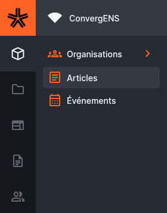

**Vous utilisez cette rubrique quand vous voulez :**

- écrire un nouvel article
- modifier un article existant
- publier / dépublier un article

---

## 📅 Events

Ici, vous créez et gérez les **événements** : date/heure, lieu, organisation, co-organisation, et éventuellement les articles liés.

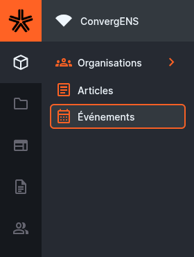

**Vous utilisez cette rubrique quand vous voulez :**

- ajouter un événement
- changer une date, un lieu, ou une description
- publier / archiver un événement

---

<!-- ## 📁 Details -->
<!---->
<!-- Cette rubrique regroupe “les réglages de fond” du site : des listes et options qui servent partout ailleurs, mais que vous n’aurez **presque jamais** besoin de modifier. -->
<!---->
<!-- On y trouve par exemple : -->
<!---->
<!-- - les **langues** -->
<!-- - les **types d’organisation** (organisation types) -->
<!-- - parfois d’autres listes techniques utilisées dans les formulaires -->
<!---->
<!-- 👉 En général : **n’y touchez pas** mais jetez un œil si vous êtes curieux. -->
<!---->
<!-- --- -->
<!---->
<!-- ## 🌐 Socials -->
<!---->
<!-- Ici, vous gérez les **liens de réseaux sociaux** d’une organisation (YouTube, Facebook, Instagram, etc.).   -->
<!-- En général : **1 ligne = 1 réseau social + 1 lien**. -->
<!---->
<!-- **Vous utilisez cette rubrique quand vous voulez :** -->
<!---->
<!-- - ajouter un lien Instagram / YouTube / etc. -->
<!-- - corriger un lien -->
<!-- - supprimer un lien qui n’est plus valable -->
<!---->
<!-- --- -->

# Et maintenant ? Stop 🛑

Pour commencer simplement, je vous conseille de passer à la section suivante : **mettre à jour votre organisation**.

👉 Pourquoi ? Parce que c’est l’action la plus fréquente et la plus utile au quotidien (logo, description, liens, contacts…).  
Une fois que votre organisation est à jour, vous pourrez revenir ici plus tard pour découvrir des options plus “avancées” comme les **filtres**, les **vues** (tableau / cartes / calendrier) et les **favoris** (bookmarks).

➡️ Prochaine étape : [Organisations → Mon Organisation](organisations.html)

# Section avancée : Explorer une collection (liste d’items)

Dans une collection, vous retrouvez généralement :

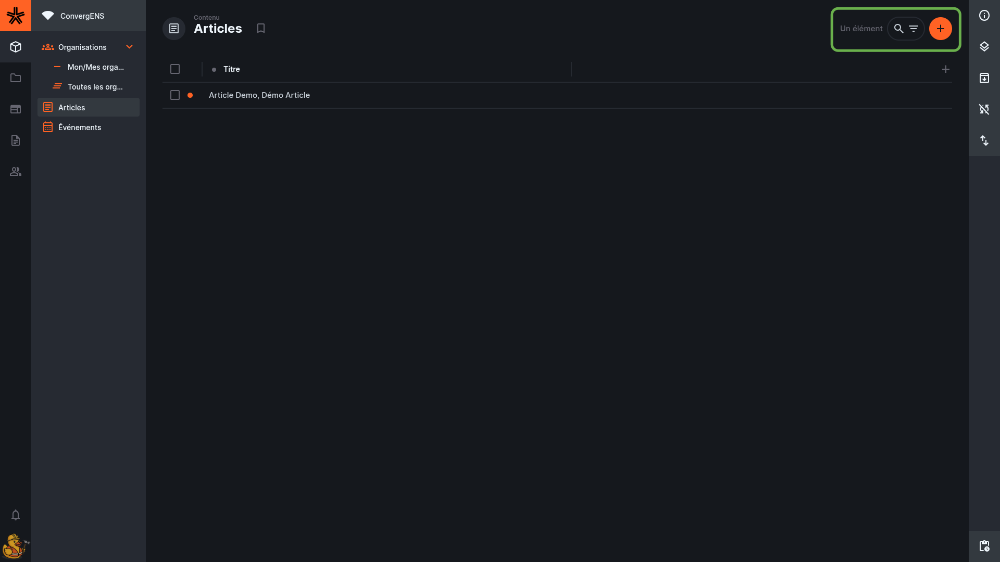
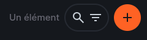

- une **barre de recherche**
- un bouton **filtrer**
- des actions de **tri**
- le choix des **colonnes visibles** (selon layout)
- un bouton **Créer** (si autorisé)

## Recherche vs filtre

- **Recherche** : rapide, utile pour un titre, un slug, un mot-clé  
  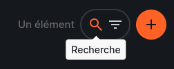
  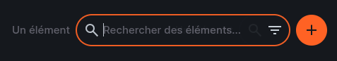
- **Filtre** : précis, combinable, réutilisable (utile pour “tous les brouillons”, “événements futurs”, “articles d’un tag”)  
  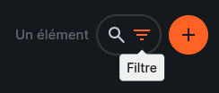
  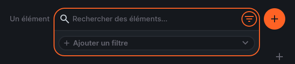

---

# Filtrer des items

Les filtres permettent d’afficher uniquement les items qui respectent certains critères.

Exemples fréquents (ConvergENS) :

- afficher uniquement les contenus **publiés** : `status = published`
- afficher les **brouillons** : `status = draft`
- afficher les événements **à venir** : `start_at >= NOW`
- afficher les articles d’un **tag** : `tag.id = …`
- afficher les items liés à un **collectif** (via relation ou jonction)

## Avant l'ajout des filtres

## Nous ajoutons un filtre

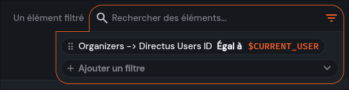

## Après l'ajout des filtres

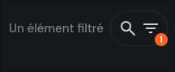
Ce symbole à côté de la recherche indique qu'un filtre est utilisé.

## Groupes AND / OR

L'Éditeur permet de combiner des conditions :

- **AND** : toutes les conditions doivent être vraies
- **OR** : au moins une condition doit être vraie

Dans l’UI, les conditions doivent être **indentées** sous le groupe AND/OR pour y appartenir.

---

## Variables dynamiques (très utile)

L'Éditeur fournit des variables “dynamiques” utilisables dans les filtres (et parfois dans des rules/policies selon la configuration).

| Variable            | Sert à…                                 | Exemple d’usage                                 |
| ------------------- | --------------------------------------- | ----------------------------------------------- |
| `$CURRENT_USER`     | l’identifiant de l’utilisateur connecté | montrer “mes items” si un champ stocke l’auteur |
| `$CURRENT_ROLE`     | rôle courant                            | utile en logique d’accès                        |
| `$CURRENT_ROLES`    | liste de rôles (incluant héritage)      | logique avancée                                 |
| `$CURRENT_POLICIES` | policies appliquées                     | diagnostic / logique avancée                    |
| `$NOW`              | timestamp actuel                        | événements à venir / contenus récents           |
| `$NOW(+2 hours)`    | timestamp ajusté                        | “dans 2h”, “il y a 1 an”, etc.                  |

> Exemple pratique : filtrer les événements “futurs” avec `start_at >= $NOW` (ou `$NOW(-1 day)` pour inclure ceux d’hier).

> Exemple pratique : Organizers -> L'Éditeur Users ID Égal à $CURRENT_USER

---

# Layouts (affichages)

Un **layout** est une façon d’afficher les items :

- **Table** (le plus courant)
- **Cards** (pratique pour contenu visuel)
- d’autres layouts selon les champs (ex : calendrier, carte…), si activés

Les layouts peuvent restreindre certaines options selon le modèle de données (notamment les relations).

---

# Favoris (presets)

Les **favoris** sont des vues enregistrées d’une collection :

- colonnes visibles
- tri
- filtres
- layout

C’est utile pour créer des raccourcis du type :

- “Mes brouillons”
- “Articles publiés”
- “Événements à venir”

Création :
