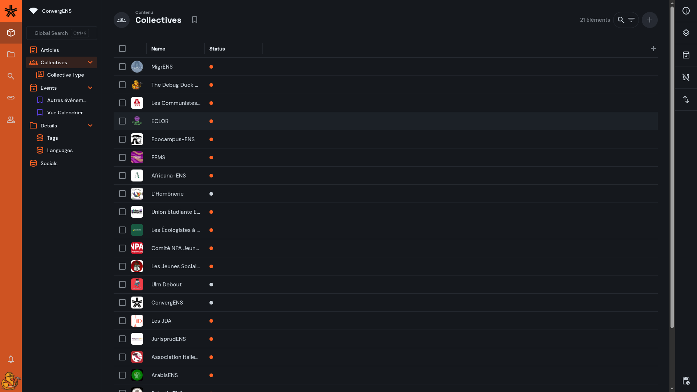
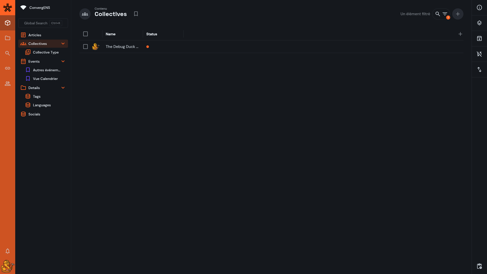

Directus est l’interface d’administration (“CMS”) qui pilote les contenus de ConvergENS. Il se place **au-dessus de la base de données** : vous manipulez des **collections** (tables), des **items** (lignes) et des **relations** (liens entre collections), avec des droits d’accès gérés par **rôles** et **policies**.

## Les concepts clés

### Collection

Une **collection** correspond à un type de contenu (ex : `articles`, `events`, `collectives`, `tags`, `socials`, etc.).  
Chaque collection contient des **items**.

### Item

Un **item** est une entrée unique (ex : un article précis, un événement précis).

### Champs (fields)

Un item est composé de **champs** : texte, date, booléen, sélection, relation, fichier (image), etc.

### Relations (liens entre collections)

> **À noter :** vous n’aurez généralement pas besoin de connaître ces notions “techniques” pour créer ou modifier du contenu au quotidien.  
> Ces notions sont surtout utiles pour comprendre comment les contenus sont liés entre eux ; elles ne sont pas indispensables pour l’édition quotidienne.

Directus permet de relier des données :

- **Many-to-One (M2O)** : plusieurs items pointent vers un seul (ex : un `article` → un `tag`)
- **One-to-Many (O2M)** : inverse du M2O
- **Many-to-Many (M2M)** : plusieurs ↔ plusieurs via une table de jonction (ex : `articles` ↔ `collectives` via `editors`, ou `articles` ↔ `events` via une jonction)

Ces relations servent à :

- afficher des informations associées (ex : dans un article, voir les collectifs éditeurs)
- filtrer/chercher “à travers” les liens
- automatiser certaines contraintes (ex : limiter la sélection à “mon collectif” selon l’utilisateur)

### Permissions, rôles et policies

Ce que vous voyez (collections, items, champs) dépend de vos **droits** :

- un rôle peut limiter l’accès à certaines collections ou certaines actions (lecture/écriture/suppression)
- des policies peuvent restreindre les items visibles (ex : ne voir que les items liés à votre collectif)

> Si vous “ne trouvez pas” un item ou un champ, c’est souvent un **filtre** actif… ou un **droit** qui masque l’information.

---

## Où travailler dans Directus

### 1) Module **Contenu** (Content)

C’est l’endroit principal pour :

- parcourir les collections
- rechercher, filtrer, trier
- créer/éditer des items

Vous naviguez généralement ainsi :
**Contenu → choisir une collection → liste d’items → ouvrir un item (éditeur)**

### 2) **Éditeur d’item**

Quand vous ouvrez un item, vous voyez un formulaire avec ses champs :

- champs simples (texte, date…)
- champs relationnels (liens vers tags, collectifs, événements…)
- champs fichiers (images / assets)

### 3) Paramètres (Settings)

Réservé aux usages avancés / admin :

- configuration de l’interface
- administration (selon droits)

---

## Explorer une collection (liste d’items)

Dans une collection, vous retrouvez généralement :

- une **barre de recherche**
- des actions de **tri**
- un bouton **Filtrer**
- le choix des **colonnes visibles** (selon layout)
- un bouton **Créer** (si autorisé)

### Recherche vs filtre

- **Recherche** : rapide, utile pour un titre, un slug, un mot-clé
- **Filtre** : précis, combinable, réutilisable (utile pour “tous les brouillons”, “événements futurs”, “articles d’un tag”)

---

## Filtrer des items

Les filtres permettent d’afficher uniquement les items qui respectent certains critères.

Exemples fréquents (ConvergENS) :

- afficher uniquement les contenus **publiés** : `status = published`
- afficher les **brouillons** : `status = draft`
- afficher les événements **à venir** : `start_at >= NOW`
- afficher les articles d’un **tag** : `tag.id = …`
- afficher les items liés à un **collectif** (via relation ou jonction)

### Avant l'ajout des filtres

### Nous ajoutons un filtre

### Après l'ajout des filtres

Ce symbole à côté de la recherche indique qu'un filtre est utilisé.

### Groupes AND / OR

Directus permet de combiner des conditions :

- **AND** : toutes les conditions doivent être vraies
- **OR** : au moins une condition doit être vraie

Dans l’UI, les conditions doivent être **indentées** sous le groupe AND/OR pour y appartenir.

---

## Variables dynamiques (très utile)

Directus fournit des variables “dynamiques” utilisables dans les filtres (et parfois dans des rules/policies selon la configuration).

| Variable            | Sert à…                                 | Exemple d’usage                                 |
| ------------------- | --------------------------------------- | ----------------------------------------------- |
| `$CURRENT_USER`     | l’identifiant de l’utilisateur connecté | montrer “mes items” si un champ stocke l’auteur |
| `$CURRENT_ROLE`     | rôle courant                            | utile en logique d’accès                        |
| `$CURRENT_ROLES`    | liste de rôles (incluant héritage)      | logique avancée                                 |
| `$CURRENT_POLICIES` | policies appliquées                     | diagnostic / logique avancée                    |
| `$NOW`              | timestamp actuel                        | événements à venir / contenus récents           |
| `$NOW(+2 hours)`    | timestamp ajusté                        | “dans 2h”, “il y a 1 an”, etc.                  |

> Exemple pratique : filtrer les événements “futurs” avec `start_at >= $NOW` (ou `$NOW(-1 day)` pour inclure ceux d’hier).

> Exemple pratique : Organizers -> Directus Users ID Égal à $CURRENT_USER

---

## Layouts (affichages)

Un **layout** est une façon d’afficher les items :

- **Table** (le plus courant)
- **Cards** (pratique pour contenu visuel)
- d’autres layouts selon les champs (ex : calendrier, carte…), si activés

Les layouts peuvent restreindre certaines options selon le modèle de données (notamment les relations).

---

## Bookmarks (presets)

Les **bookmarks** sont des vues enregistrées d’une collection :

- colonnes visibles
- tri
- filtres
- layout

C’est utile pour créer des raccourcis du type :

- “Mes brouillons”
- “Articles publiés”
- “Événements à venir”

Création :

---

## Bonnes pratiques ConvergENS

- **Statut** : gardez `draft` tant que le contenu n’est pas prêt ; passez en `published` au moment voulu.
- **Traductions** : si une collection a des champs `translations`, vérifiez que la langue est correcte et que les champs requis sont remplis.
- **Relations** : privilégiez les champs relationnels (tags, collectifs, événements) plutôt que de recopier du texte — cela garantit cohérence et liens automatiques côté site.
- **Images / assets** : utilisez la médiathèque Directus, et évitez de coller des URLs externes quand ce n’est pas nécessaire.
- **Slugs** : si vous avez un champ `slug`, gardez-le stable (il sert souvent dans les URLs).

---

## Dépannage rapide

### “Je ne vois pas un item”

1. Vérifiez qu’un **filtre** n’est pas actif
1. Vérifiez qu’un **recherche** n’est pas actif
1. Si l'événement ou l'article a été créé par une autre organisation, celle-ci a-t-elle ajouté mon organisation à la liste des « Éditeurs » ou « Organisateurs » ?
1. Possible restriction de **permissions/policies**

### “Je ne peux pas modifier un champ”

- champ en lecture seule, ou droits insuffisants
- champ masqué par rôle
- workflow de validation (selon configuration)

### “Je ne trouve pas un événement lié à un article”

- vérifier la relation (souvent via une collection de jonction)
- vérifier que l’item lié est publié/accessible selon vos droits

<!-- # Layouts -->
<!---->
<!-- Les **layouts** (mises en page) sont des modes d’affichage qui permettent de **visualiser** et **interagir** avec les items d’une collection.   -->
<!-- Selon la collection et ses champs (dates, images, géolocalisation…), certains layouts seront plus adaptés que d’autres. -->
<!---->
<!-- ## À quoi servent les layouts ? -->
<!---->
<!-- Un layout change **la façon dont la liste d’items est présentée**, sans modifier les données elles-mêmes. -->
<!---->
<!-- Exemples (ConvergENS) : -->
<!---->
<!-- - `articles` : souvent plus confortable en **Table** (tri, colonnes) ou en **Cards** (si couverture/visuels) -->
<!-- - `events` : très pratique en **Calendar** (vue par mois/semaine/jour) -->
<!-- - collections avec images (ex: bibliothèque de fichiers) : **Cards** -->
<!-- - collections avec coordonnées : **Map** -->
<!---->
<!-- ## Changer le layout d’une collection -->
<!---->
<!-- 1. Ouvrez **Contenu** dans le menu de gauche -->
<!-- 2. Cliquez sur la **collection** (ex : `events`) -->
<!-- 3. Dans la barre latérale, ouvrez **Layout Options** -->
<!-- 4. Choisissez un type de layout (Table, Cards, Calendar, etc.) -->
<!-- 5. Ajustez les options proposées -->
<!---->
<!-- > Les layouts dépendent du **modèle de données** : -->
<!-- > -->
<!-- > - **Calendar** nécessite au moins un champ **date/heure** (datetime) -->
<!-- > - **Map** nécessite un champ **géospatial** (map) -->
<!-- > - Certains layouts offrent moins d’options (ex : Map n’a pas de tri par colonnes) -->
<!---->
<!-- --- -->
<!---->
<!-- ## Où se trouvent les réglages d’un layout ? -->
<!---->
<!-- Les contrôles de personnalisation peuvent se trouver à trois endroits : -->
<!---->
<!-- - **Layout Options** (barre latérale) : configuration du layout -->
<!-- - **Sous-en-tête** (juste sous le header) : actions rapides (taille, tri, navigation…) -->
<!-- - **Zone centrale** (page area) : affichage + interaction directe (sélection, drag & drop…) -->
<!---->
<!-- Ces réglages couvrent généralement : -->
<!---->
<!-- - **Style / format** (taille, recadrage des images, densité) -->
<!-- - **Champs affichés** (titre, sous-titre, image, colonnes…) -->
<!-- - **Tri / ordre** (automatique ou manuel selon layout et configuration) -->
<!---->
<!-- --- -->
<!---->
<!-- ## Layout Table (Tableau) -->
<!---->
<!-- Le layout **Table** affiche les items en lignes/colonnes.   -->
<!-- C’est le layout le plus universel et celui qui offre le plus de contrôle (tri, colonnes, sélection…). -->
<!---->
<!-- ### Quand l’utiliser ? -->
<!---->
<!-- - Pour travailler “en admin” : vérifier des statuts, dates, tags, slugs… -->
<!-- - Pour comparer beaucoup d’items rapidement -->
<!-- - Pour trier et filtrer efficacement -->
<!---->
<!-- ### Options fréquentes -->
<!---->
<!-- - **Spacing** : densité / hauteur des lignes -->
<!---->
<!-- ### Actions utiles (table) -->
<!---->
<!-- - **Ajouter une colonne** : bouton “+” dans le sous-en-tête -->
<!-- - **Masquer une colonne** : menu sur l’en-tête de colonne → _Hide Field_ -->
<!-- - **Trier** : menu sur l’en-tête de colonne → asc/desc -->
<!-- - **Réordonner les colonnes** : glisser-déposer l’en-tête -->
<!---->
<!-- ### Tri manuel (si configuré) -->
<!---->
<!-- Le tri manuel (drag & drop) n’est disponible que si la collection possède un **champ de tri** (sort) configuré côté modèle de données. -->
<!---->
<!-- ::callout{icon="material-symbols:info-outline"} -->
<!-- **Tri manuel = configuration requise**   -->
<!-- Si vous ne voyez pas l’option de tri manuel, c’est normal : la collection n’a probablement pas de champ `sort` configuré. -->
<!-- :: -->
<!---->
<!-- --- -->
<!---->
<!-- ## Layout Cards (Cartes) -->
<!---->
<!-- Le layout **Cards** affiche les items sous forme de tuiles.   -->
<!-- Il est idéal lorsque l’affichage repose sur **une image** (couverture, logo, média). -->
<!---->
<!-- ### Quand l’utiliser ? -->
<!---->
<!-- - Bibliothèque de fichiers / médias -->
<!-- - Items avec une couverture ou un logo (ex : collectifs) -->
<!-- - Pour un repérage visuel rapide -->
<!---->
<!-- ### Options fréquentes (Cards) -->
<!---->
<!-- - **Image Source** : champ image utilisé (ex : `cover`, `logo`) -->
<!-- - **Title / Subtitle** : gabarits d’affichage (templates) -->
<!-- - **Image Fit** : recadrage / ajustement -->
<!-- - **Fallback Icon** : icône si pas d’image -->
<!---->
<!-- ### Actions utiles (Cards) -->
<!---->
<!-- - Ajuster la **taille des cartes** -->
<!-- - Trier par un champ (date, nom, etc.) -->
<!-- - Sélectionner plusieurs items -->
<!---->
<!-- --- -->
<!---->
<!-- ## Layout Calendar (Calendrier) -->
<!---->
<!-- Le layout **Calendar** affiche les items dans une vue temporelle (mois/semaine/jour).   -->
<!-- Très utile pour la collection `events`. -->
<!---->
<!-- ### Quand l’utiliser ? -->
<!---->
<!-- - Événements, rendez-vous, deadlines -->
<!-- - Vue globale sur une période -->
<!---->
<!-- ### Options fréquentes (Calendar) -->
<!---->
<!-- - **Start Date Field** : champ début (ex : `start_at`) -->
<!-- - **End Date Field** : champ fin (ex : `end_at`) -->
<!-- - **Display Template** : texte affiché dans l’événement (ex : titre + lieu) -->
<!-- - **First Day of the Week** : début de semaine (souvent lundi en France) -->
<!---->
<!-- ### Navigation (Calendar) -->
<!---->
<!-- - boutons mois/année (chevrons) -->
<!-- - bouton **Today** -->
<!-- - bascule de vue (mois/semaine/jour) -->
<!---->
<!-- ::callout{icon="material-symbols:info-outline"} -->
<!-- **Configuration requise**   -->
<!-- Calendar nécessite au moins un champ datetime (début), et idéalement deux (début + fin). -->
<!-- :: -->
<!---->
<!-- --- -->
<!---->
<!-- ## Layout Map (Carte) -->
<!---->
<!-- Le layout **Map** affiche les items sur une carte, sous forme de points ou géométries (lignes/polygones). -->
<!---->
<!-- ### Quand l’utiliser ? -->
<!---->
<!-- - Données géolocalisées : lieux, zones, parcours -->
<!-- - Toute collection avec champ map/géospatial -->
<!---->
<!-- ### Options fréquentes (Map) -->
<!---->
<!-- - **Basemap** : fournisseur de carte -->
<!-- - **Geospatial Field** : champ géospatial à afficher -->
<!-- - **Display Template** : infos affichées au survol -->
<!-- - **Cluster Nearby Data** : regrouper les points proches -->
<!---->
<!-- ::callout{icon="material-symbols:info-outline"} -->
<!-- **Configuration requise**   -->
<!-- Map nécessite un champ géospatial (map) configuré dans la collection. -->
<!-- :: -->
<!---->
<!-- --- -->
<!---->
<!-- ## Layout Kanban -->
<!---->
<!-- Le layout **Kanban** affiche les items en colonnes, groupés par un champ “statut”.   -->
<!-- Il est parfait pour du suivi de tâches (type “À faire / En cours / Terminé”). -->
<!---->
<!-- ### Quand l’utiliser ? -->
<!---->
<!-- - To-do, pipeline, validation éditoriale (si votre modèle le prévoit) -->
<!-- - Suivi par étapes -->
<!---->
<!-- ### Options fréquentes (Kanban) -->
<!---->
<!-- - **Group By** : champ utilisé pour les colonnes (statut) -->
<!-- - **Card Title / Card Text** : champs affichés sur la carte -->
<!-- - Options avancées : tags, date, image, utilisateur… -->
<!---->
<!-- ### Interaction -->
<!---->
<!-- - Glisser-déposer une carte change son statut (si autorisé) -->
<!-- - Ajouter une colonne (nouveau statut) -->
<!-- - Ajouter une carte directement dans une colonne -->
<!---->
<!-- ::callout{icon="material-symbols:info-outline"} -->
<!-- **Configuration requise**   -->
<!-- Kanban nécessite un champ “statut” adapté (souvent une sélection / enum) pour alimenter les colonnes. -->
<!-- :: -->
<!---->
<!-- --- -->
<!---->
<!-- ## Bonnes pratiques (ConvergENS) -->
<!---->
<!-- - Utilisez **Table** pour l’administration (statuts, dates, tags, vérifications) -->
<!-- - Utilisez **Calendar** pour `events` (meilleure lecture du planning) -->
<!-- - Utilisez **Cards** pour les collections orientées visuels (logos, covers, médias) -->
<!-- - Si un layout n’apparaît pas, c’est généralement qu’il manque un champ requis (datetime, map, etc.) -->
