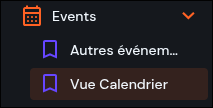

# Événements

La collection **events** sert à gérer les événements affichés sur ConvergENS : **titre/description (traductions)**, **dates**, **lieu**, **organisation porteuse** et **co-organisateurs**, ainsi que les liens vers des **articles associés**.

<!-- prettier-ignore-start -->

- TOC
{:toc}
<!-- prettier-ignore-end -->

## Où trouver les événements ?

Dans l’éditeur du site : **Contenu → events**.  
Vous pouvez aussi y accéder depuis un **article**, via le champ **Événements** (sélection / liaison d’événements).

Vous verrez la liste des articles (avec filtres). En ouvrant un article, vous accédez à tous ses champs pour le compléter et le publier.

Pour créer un nouvel article, cliquez sur le gros bouton « + » « Créer un élément ».

> Astuce : pour une vue plus confortable, utilisez le layout **Calendar** (calendrier) si disponible.  
> 

---

# À remplir en priorité

> Objectif : en remplissant juste cette partie, vous pouvez déjà enregistrer et revenir plus tard.

## Statut ✅

- **Nom dans l’éditeur du site** : `status` (champ “Statut”)
- **À quoi ça sert** : contrôle si l’événement est visible sur le site.
- **Comment le remplir** :
  - **Brouillon** tant que l’événement n’est pas finalisé
  - **Publié** quand il doit apparaître sur le site
  - **Archivé** pour le retirer sans le supprimer
- **Exemple** : `Statut = Brouillon` pendant la préparation
- **Conseil** : ne passez en **Publié** qu’après vérification des dates + traductions.

---

## Organisations organisatrices ✅

- **Nom dans l’éditeur du site** : `organisers` (Organisations organisatrices)
- **À quoi ça sert** : définit **quelles organisations peuvent modifier l’événement** et **comment il apparaît** dans l’interface.
- **Comment le remplir** :
  - ajouter **au moins 1 organisation**
  - mettre l’organisation porteuse **en 1ère position** : c’est elle qui sera considérée comme principale
  - ajouter ensuite les co-organisateurs, dans l’ordre souhaité
- **Exemple** : `organisers = [The Debug Duck Society, Organisation partenaire]`
- **Conseil** : gardez une liste courte et pertinente : n’ajoutez que les organisations qui doivent vraiment **avoir les droits d’édition**.

> ℹ️ **Organisation porteuse (important)** : la **première organisation** de la liste est l’**organisation porteuse**.  
> Sa **couleur** est utilisée dans l’UI (ex. couleur de la “pastille” de l’événement dans le calendrier).

> Si vous ne voyez que votre organisation et que vous voulez ajouter des co-organisateurs, vérifiez que vous n’avez pas de **filtres** actifs dans la liste (recherche, tags, etc.).

**Où ça s’affiche** :

- sur la page **Calendrier** : couleur de la **pastille** / “pill” de l’événement
- sur la **fiche** / **pop-up** de l’événement : affichage des organisations

---

### À retenir

- **Obligatoire** : Organisations organisatrices doit contenir **au moins 1 organisation**.
- **Droits** : toute organisation ajoutée ici peut **modifier** l’événement.
- **Accès** : l’organisation qui **a créé** l’événement garde l’accès **même si elle est retirée** de la liste.

---

# Traductions ✅

- **FR obligatoire**, **EN recommandé**
- Remplir **FR d’abord**, puis **EN**

> Selon le modèle configuré, vous trouverez typiquement le **titre** et le **contenu** dans les traductions.

➡️ Voir : **[Guide éditeur de texte](wysisyg.html)**

## Titre ✅

- **Nom dans l’éditeur du site** : `Title`
- **À quoi ça sert** : titre multilingue de l’événement (au moins **FR**).
- **Comment le remplir** :
  - compléter **FR** en premier (langue principale dans l’interface)
  - ajouter **EN** si possible
- **Conseil** : gardez un titre clair et un contenu aéré (sections, listes, liens).

## Description ✅

- **Nom dans l’éditeur du site** : `Description`
- **À quoi ça sert** :
- **Comment le remplir** :
  - compléter **FR** en premier (langue principale dans l’interface)
  - ajouter **EN** si possible
- **Conseil** :

---

# Traductions ✅

- **FR obligatoire**, **EN recommandé**
- Remplir **FR d’abord**, puis **EN**

> Ici, **Titre** et **Description** sont en **texte simple** (pas de mise en forme : pas de titres, listes, liens cliquables, etc.).

## Titre ✅

- **Nom dans l’éditeur du site** : `Title`
- **À quoi ça sert** : nom de l’événement, affiché dans le **calendrier** et sur la **fiche événement**.
- **Exemple** : “Conférence — Écologies urbaines : programme et inscriptions”
- **Conseil** : restez court et explicite (type d’événement + thème).

## Description (optionnel)

Facultatif mais fortement recommandé

- **Nom dans l’éditeur du site** : `Description`
- **À quoi ça sert** : courte description affichée sur la **fiche événement**.
- **Comment le remplir** :
  - compléter **FR** en premier
  - ajouter **EN** si possible
  - écrire en 1–3 phrases simples (pas de mise en forme)
- **Exemple** : “Rencontre ouverte à toutes et tous. Inscription recommandée. Accueil dès 17h45.”
- **Conseil** : mettez l’info la plus utile au début (quoi / pourquoi).

# Dates et horaires ✅

> **Important :** les champs **Début** (`start_at`) et **Fin** (`end_at`) sont **toujours obligatoires**.  
> Si **Journée entière** est activé, les **heures** (HH:MM) n’ont **pas d’effet** : seules les **dates** comptent.

## Début / fin ✅

- **Nom dans l’éditeur du site** : `start_at` (Début), `end_at` (Fin)
- **À quoi ça sert** : définit quand l’événement a lieu (affichage calendrier + tri).
- **Comment le remplir** :
  - saisir une **date/heure** de début
  - saisir une **date/heure** de fin
- **Exemple** : `start_at = 18:00` / `end_at = 20:00`
- **Conseil** : la fin doit être **après** le début (timezone comprise).

## Journée entière (optionnel)

- **Nom dans l’éditeur du site** : `all_day` (Journée entière)
- **À quoi ça sert** : indique que l’événement est “sur la journée”.
- **Comment le remplir** :
  - cocher si l’événement dure toute la journée
  - garder des **dates cohérentes** (même jour, ou période attendue)
- **Exemple** : colloque sur une journée → `all_day = true`
- **Conseil** : même si les heures ne comptent plus, vérifiez que la période (début/fin) est correcte.

# Options (facultatif)

## Lieu (nom court)

- **Nom dans l’éditeur du site** : `location` (Lieu)
- **À quoi ça sert** : nom court affiché dans l’UI (ex. calendrier / fiche événement).
- **Comment le remplir** :
  - écrire un nom simple et lisible
  - éviter les adresses longues ici
- **Exemple** : `location = ENS, Salle des Actes`
- **Conseil** : gardez-le **court** (bâtiment + salle).

---

## Adresse (détails)

- **Nom dans l’éditeur du site** : `location_address` (Adresse)
- **À quoi ça sert** : adresse complète (utile pour s’y rendre).
- **Comment le remplir** :
  - indiquer rue + code postal + ville
  - ajouter des précisions si nécessaire (entrée, étage, etc.)
- **Exemple** : `location_address = 45 rue d’Ulm, 75005 Paris`
- **Conseil** : mettez ici ce qui serait “trop long” pour le champ Lieu.

---

## Articles associés (optionnel)

- **Nom dans l’éditeur du site** : `articles` (Articles associés)
- **À quoi ça sert** : relie un ou plusieurs articles à l’événement.
- **Utile pour** :
  - ajouter un lien “En savoir plus”
  - centraliser les contenus liés (annonce, infos pratiques, compte-rendu…)
- **Conseil** : liez l’article d’annonce dès que possible, puis ajoutez le compte-rendu après l’événement.

> **Créer ou sélectionner un article :**
>
> - Cliquez sur **Nouveau** pour créer un nouvel article.
> - Si l’article existe déjà, cliquez sur **Sélectionner** pour le choisir.
> - Pour plus de détails, voir : **[Guide des articles](articles.html)**.

---

## Champs techniques (automatiques)

Ces champs sont gérés par Directus (création / mise à jour).

- **Créé par** (`user_created`) : information sur le/la **propriétaire** de l’événement (organisation/utilisateur qui l’a créé).  
  Cette personne/organisation **garde toujours l’accès à l’édition** de l’événement et **ne perd pas** cet accès, même si les organisations organisatrices changent.
- `date_created` : date de création (souvent caché)
- `user_updated` : dernier éditeur (souvent caché)
- `date_updated` : date de dernière mise à jour (souvent caché)

# Options (facultatif)

## Lieu (optionnel)

- **Nom dans l’éditeur du site** : `location`, `location_address`
- **À quoi ça sert** :
  - `location` : nom court du lieu (affichage simple)
  - `location_address` : adresse détaillée (rue, CP, ville)
- **Exemples** :
  - `location = ENS, Salle des Actes`
  - `location_address = 45 rue d’Ulm, 75005 Paris`
- **Conseil** : gardez `location` court ; mettez le détail dans `location_address`.

---

## Articles associés (optionnel)

- **Nom dans l’éditeur du site** : `articles` (Articles associés)
- **À quoi ça sert** : relie un ou plusieurs articles à l’événement.
- **Utile pour** :
  - ajouter un lien “En savoir plus”
  - centraliser les contenus liés (annonce, infos pratiques, compte-rendu…)
- **Conseil** : liez l’article d’annonce dès que possible, puis ajoutez le compte-rendu après l’événement.

> **Créer ou sélectionner un article :**
>
> - Cliquez sur **Nouveau** pour créer un nouvel article.
> - Si l’article existe déjà, cliquez sur **Sélectionner** pour le choisir.
> - Pour plus de détails, voir : **[Guide des articles](articles.html)**.

---

I want to split location and location_address into two sections and to explain that User Created is there only for information to see who is the owner of the event and will never lose access to editing it

# Procédure pas à pas

1. Aller dans **Contenu → events**
2. Cliquer sur **Créer** (ou ouvrir un événement existant)
3. Remplir d’abord : **Organisations organisatrices ✅**, **Traductions (FR) ✅**, **Début/Fin ✅**
4. Ajouter si besoin : **Journée entière**, **Lieu**, **Articles associés**
5. Vérifier les informations, puis passer **Statut → Publié** quand c’est prêt

---

# Dépannage rapide

## “Je ne vois pas mon événement sur le site”

- Vérifiez **Statut = Publié**
- Vérifiez les champs obligatoires : **Organisation porteuse**, **Co-organisateurs**, **Début**, **Fin**, **Traductions**
- Vérifiez que vous regardez la bonne période (calendrier / filtres)

## “Je ne peux pas sélectionner une organisation dans Co-organisateurs”

- Selon votre rôle, les permissions peuvent limiter la liste d’organisations visibles/sélectionnables
- Contactez un admin si une organisation manque dans la liste

## “Mon événement n’apparaît pas au bon endroit dans le calendrier”

- Vérifiez **Début / Fin** (timezone, jour/heure, inversion début/fin)
- Si **Journée entière** est activé, vérifiez que les dates correspondent à une journée complète

---

---

---

---

---

---

La collection `events` sert à gérer les **événements** affichés sur ConvergENS : titre/description (traductions), dates, lieu, organisation porteuse et co-organisateurs, ainsi que les liens vers des articles associés.

<!-- prettier-ignore-start -->

- TOC
{:toc}
<!-- prettier-ignore-end -->

## Où trouver les événements ?

Dans Directus : **Contenu → events**.

> Astuce : pour une vue plus confortable, utilisez le **layout Calendar** (calendrier) si disponible.

---

## Champs principaux

### Statut

- **status** : `published` / `draft` / `archived`

Recommandation :

- **draft** tant que l’événement n’est pas finalisé
- **published** quand il doit apparaître sur le site
- **archived** pour le retirer sans le supprimer

---

## Organisation et co-organisation

### Organisation porteuse (obligatoire)

- **organisation** _(obligatoire, M2O → `organisations`)_  
  C’est l’organisation “principale” de l’événement.

### Co-organisateurs (obligatoire)

- **organisers** _(obligatoire, M2M)_  
  Permet d’associer une ou plusieurs organisations co-organisatrices.

> En pratique : utilisez `organisation` pour l’organisation principale, et `organisers` pour les co-organisations.

---

## Dates et horaires

### Début / fin (obligatoires)

- **start_at** _(obligatoire)_ : date/heure de début
- **end_at** _(obligatoire)_ : date/heure de fin

### Journée entière

- **all_day** _(optionnel)_ : cochez si l’événement dure toute la journée

> Conseil : même si `all_day` est activé, gardez des dates cohérentes (début/fin le même jour ou sur la période attendue).

---

## Lieu (optionnel)

- **location** : nom court du lieu (ex : “ENS, Salle des Actes”)
- **location_address** : adresse plus détaillée (ex : rue, code postal, ville)

---

## Traductions (obligatoire)

- **translations** _(obligatoire)_ : contenu multilingue de l’événement  
  Par défaut, le français (`fr-FR`) est la langue principale dans l’interface.

Vous y trouverez typiquement le **titre** et le **contenu** (selon ce qui a été configuré dans le modèle).

---

## Articles associés (optionnel)

- **articles** _(optionnel, M2M)_ : permet de relier un ou plusieurs articles à l’événement  
  Utile pour :
  - ajouter un lien “En savoir plus” vers un article
  - centraliser les contenus éditoriaux liés à l’événement (annonce, compte-rendu…)

---

## Champs techniques (automatiques)

Ces champs sont gérés par Directus (création / mise à jour) :

- **user_created** : créateur de l’item (visible)
- **date_created** _(caché)_ : date de création
- **user_updated** _(caché)_ : dernier éditeur
- **date_updated** _(caché)_ : date de dernière mise à jour

---

## Procédure recommandée (création)

1. **Contenu → events → Créer**
2. Renseigner :
   - `organisation` (organisation porteuse)
   - `organisers` (au moins l’org principale + co-organisateurs si besoin)
   - `start_at` / `end_at`
   - `all_day` si nécessaire
   - `location` / `location_address` si pertinent
   - `translations` (au moins FR)
3. Lier éventuellement :
   - `articles` (annonce, infos pratiques, compte-rendu…)
4. Laisser en `draft`, puis passer en `published` une fois validé

---

## Dépannage rapide

### “Je ne vois pas mon événement sur le site”

- Vérifiez `status = published`
- Vérifiez que les champs obligatoires sont bien renseignés (`organisation`, `organisers`, `start_at`, `end_at`, `translations`)
- Vérifiez que vous regardez la bonne période (calendrier / filtres)

### “Je ne peux pas sélectionner une organisation dans organisers”

- Selon votre rôle, les permissions peuvent limiter la liste d’organisations visibles/sélectionnables
- Contactez un admin si une org manque dans la liste

### “Mon événement n’apparaît pas au bon endroit dans le calendrier”

- Vérifiez `start_at` / `end_at` (timezone, jour/heure, inversion début/fin)
- Si `all_day` est activé, vérifiez que les dates correspondent à une journée complète
