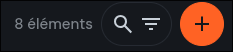

 
# Événements

La collection **events** sert à gérer les événements affichés sur ConvergENS : **titre/description (traductions)**, **dates**, **lieu**, **organisation porteuse** et **co-organisateurs**, ainsi que les liens vers des **articles associés**.

<!-- prettier-ignore-start -->
- TOC
{:toc}
<!-- prettier-ignore-end -->

## Où trouver les événements ?

Dans l’éditeur du site : **Contenu → events**.  
Vous pouvez aussi y accéder depuis un **article**, via le champ **Événements** (sélection / liaison d’événements).

Vous verrez la liste des articles (avec filtres). En ouvrant un article, vous accédez à tous ses champs pour le compléter et le publier.  

Pour créer un nouvel article, cliquez sur le gros bouton « + » « Créer un élément ».
 

> Astuce : pour une vue plus confortable, utilisez le layout **Calendar** (calendrier) si disponible.

---

# À remplir en priorité

> Objectif : en remplissant juste cette partie, vous pouvez déjà enregistrer et revenir plus tard.

## Statut ✅

- **Nom dans l’éditeur du site** : `status` (champ “Statut”)
- **À quoi ça sert** : contrôle si l’événement est visible sur le site.
- **Comment le remplir** :
  - **Brouillon** tant que l’événement n’est pas finalisé
  - **Publié** quand il doit apparaître sur le site
  - **Archivé** pour le retirer sans le supprimer
- **Exemple** : `Statut = Brouillon` pendant la préparation
- **Conseil** : ne passez en **Publié** qu’après vérification des dates + traductions.

---

## Organisation porteuse ✅

- **Nom dans l’éditeur du site** : `collective` (Organisation porteuse)
- **À quoi ça sert** : définit l’organisation “principale” de l’événement.
- **Comment le remplir** :
  - sélectionner l’organisation porteuse dans la liste
- **Exemple** : `collective = ConvergENS`
- **Conseil** : utilisez `collective` pour l’orga principale, et `organisers` pour les co-organisations.

---

## Co-organisateurs ✅

- **Nom dans l’éditeur du site** : `organisers` (Co-organisateurs)
- **À quoi ça sert** : associe une ou plusieurs organisations co-organisatrices.
- **Comment le remplir** :
  - ajouter l’orga principale si nécessaire (selon vos règles internes)
  - ajouter les co-organisateurs pertinents
- **Exemple** : `organisers = [ConvergENS, Organisation partenaire]`
- **Conseil** : si une organisation manque dans la liste, voir le dépannage (permissions).

---

## Dates et horaires ✅

### Début / fin

- **Nom dans l’éditeur du site** : `start_at` (Début), `end_at` (Fin)
- **À quoi ça sert** : définit quand l’événement a lieu (affichage calendrier + tri).
- **Comment le remplir** :
  - saisir une date/heure de début
  - saisir une date/heure de fin
- **Exemple** : `start_at = 18:00` / `end_at = 20:00`
- **Conseil** : vérifiez que la fin est bien **après** le début (timezone comprise).

### Journée entière (optionnel)

- **Nom dans l’éditeur du site** : `all_day` (Journée entière)
- **À quoi ça sert** : indique que l’événement dure toute la journée.
- **Comment le remplir** :
  - cocher si nécessaire
  - garder des dates cohérentes (même jour, ou période attendue)
- **Exemple** : colloque sur une journée → `all_day = true`
- **Conseil** : même avec `all_day`, les dates doivent rester logiques.

---

## Traductions ✅

- **Nom dans l’éditeur du site** : `translations` (Traductions)
- **À quoi ça sert** : contenu multilingue de l’événement (au moins **FR**).
- **Comment le remplir** :
  - compléter **FR** en premier (langue principale dans l’interface)
  - ajouter **EN** si possible
- **Exemple** : FR complet, EN version courte
- **Conseil** : gardez un titre clair et un contenu aéré (sections, listes, liens).

---

# Traductions ✅

- **FR obligatoire**, **EN recommandé**
- Remplir **FR d’abord**, puis **EN**

> Selon le modèle configuré, vous trouverez typiquement le **titre** et le **contenu** dans les traductions.

➡️ Voir : **[Guide éditeur de texte](wysisyg.html)**

---

# Options (facultatif)

## Lieu

- **Nom dans l’éditeur du site** : `location`, `location_address`
- **À quoi ça sert** :
  - `location` : nom court du lieu (affichage simple)
  - `location_address` : adresse détaillée (rue, CP, ville)
- **Exemples** :
  - `location = ENS, Salle des Actes`
  - `location_address = 45 rue d’Ulm, 75005 Paris`
- **Conseil** : gardez `location` court ; mettez le détail dans `location_address`.

---

## Articles associés

- **Nom dans l’éditeur du site** : `articles` (Articles associés)
- **À quoi ça sert** : relie un ou plusieurs articles à l’événement.
- **Utile pour** :
  - ajouter un lien “En savoir plus”
  - centraliser les contenus liés (annonce, infos pratiques, compte-rendu…)
- **Conseil** : liez l’article d’annonce dès que possible, puis ajoutez le compte-rendu après l’événement.

> **Créer ou sélectionner un article :**
> - Cliquez sur **Nouveau** pour créer un nouvel article.
> - Si l’article existe déjà, cliquez sur **Sélectionner** pour le choisir.
> - Pour plus de détails, voir : **[Guide des articles](articles.html)**.

---

## Champs techniques (automatiques)

Ces champs sont gérés par Directus (création / mise à jour) :

- `user_created` : créateur de l’item (visible)
- `date_created` : date de création (souvent caché)
- `user_updated` : dernier éditeur (souvent caché)
- `date_updated` : date de dernière mise à jour (souvent caché)

---

# Procédure pas à pas

1. Aller dans **Contenu → events**
2. Cliquer sur **Créer** (ou ouvrir un événement existant)
3. Remplir d’abord : **Organisation porteuse ✅**, **Co-organisateurs ✅**, **Début/Fin ✅**, **Traductions (FR) ✅**
4. Ajouter si besoin : **Journée entière**, **Lieu**, **Articles associés**
5. Vérifier les informations, puis passer **Statut → Publié** quand c’est prêt

---

# Dépannage rapide

## “Je ne vois pas mon événement sur le site”

- Vérifiez **Statut = Publié**
- Vérifiez les champs obligatoires : **Organisation porteuse**, **Co-organisateurs**, **Début**, **Fin**, **Traductions**
- Vérifiez que vous regardez la bonne période (calendrier / filtres)

## “Je ne peux pas sélectionner une organisation dans Co-organisateurs”

- Selon votre rôle, les permissions peuvent limiter la liste d’organisations visibles/sélectionnables
- Contactez un admin si une organisation manque dans la liste

## “Mon événement n’apparaît pas au bon endroit dans le calendrier”

- Vérifiez **Début / Fin** (timezone, jour/heure, inversion début/fin)
- Si **Journée entière** est activé, vérifiez que les dates correspondent à une journée complète

---
---
---
---
---
---
La collection `events` sert à gérer les **événements** affichés sur ConvergENS : titre/description (traductions), dates, lieu, organisation porteuse et co-organisateurs, ainsi que les liens vers des articles associés.

<!-- prettier-ignore-start -->
- TOC
{:toc}
<!-- prettier-ignore-end -->

## Où trouver les événements ?

Dans Directus : **Contenu → events**.

> Astuce : pour une vue plus confortable, utilisez le **layout Calendar** (calendrier) si disponible.

---

## Champs principaux

### Statut

- **status** : `published` / `draft` / `archived`

Recommandation :
- **draft** tant que l’événement n’est pas finalisé
- **published** quand il doit apparaître sur le site
- **archived** pour le retirer sans le supprimer

---

## Organisation et co-organisation

### Organisation porteuse (obligatoire)

- **collective** *(obligatoire, M2O → `collectives`)*  
  C’est l’organisation “principale” de l’événement.

### Co-organisateurs (obligatoire)

- **organisers** *(obligatoire, M2M)*  
  Permet d’associer une ou plusieurs organisations co-organisatrices.

> En pratique : utilisez `collective` pour l’organisation principale, et `organisers` pour les co-organisations.

---

## Dates et horaires

### Début / fin (obligatoires)

- **start_at** *(obligatoire)* : date/heure de début
- **end_at** *(obligatoire)* : date/heure de fin

### Journée entière

- **all_day** *(optionnel)* : cochez si l’événement dure toute la journée

> Conseil : même si `all_day` est activé, gardez des dates cohérentes (début/fin le même jour ou sur la période attendue).

---

## Lieu (optionnel)

- **location** : nom court du lieu (ex : “ENS, Salle des Actes”)
- **location_address** : adresse plus détaillée (ex : rue, code postal, ville)

---

## Traductions (obligatoire)

- **translations** *(obligatoire)* : contenu multilingue de l’événement  
  Par défaut, le français (`fr-FR`) est la langue principale dans l’interface.

Vous y trouverez typiquement le **titre** et le **contenu** (selon ce qui a été configuré dans le modèle).

---

## Articles associés (optionnel)

- **articles** *(optionnel, M2M)* : permet de relier un ou plusieurs articles à l’événement  
  Utile pour :
  - ajouter un lien “En savoir plus” vers un article
  - centraliser les contenus éditoriaux liés à l’événement (annonce, compte-rendu…)

---

## Champs techniques (automatiques)

Ces champs sont gérés par Directus (création / mise à jour) :

- **user_created** : créateur de l’item (visible)
- **date_created** *(caché)* : date de création
- **user_updated** *(caché)* : dernier éditeur
- **date_updated** *(caché)* : date de dernière mise à jour

---

## Procédure recommandée (création)

1. **Contenu → events → Créer**
2. Renseigner :
   - `collective` (organisation porteuse)
   - `organisers` (au moins l’org principale + co-organisateurs si besoin)
   - `start_at` / `end_at`
   - `all_day` si nécessaire
   - `location` / `location_address` si pertinent
   - `translations` (au moins FR)
3. Lier éventuellement :
   - `articles` (annonce, infos pratiques, compte-rendu…)
4. Laisser en `draft`, puis passer en `published` une fois validé

---

## Dépannage rapide

### “Je ne vois pas mon événement sur le site”
- Vérifiez `status = published`
- Vérifiez que les champs obligatoires sont bien renseignés (`collective`, `organisers`, `start_at`, `end_at`, `translations`)
- Vérifiez que vous regardez la bonne période (calendrier / filtres)

### “Je ne peux pas sélectionner une organisation dans organisers”
- Selon votre rôle, les permissions peuvent limiter la liste d’organisations visibles/sélectionnables
- Contactez un admin si une org manque dans la liste

### “Mon événement n’apparaît pas au bon endroit dans le calendrier”
- Vérifiez `start_at` / `end_at` (timezone, jour/heure, inversion début/fin)
- Si `all_day` est activé, vérifiez que les dates correspondent à une journée complète
