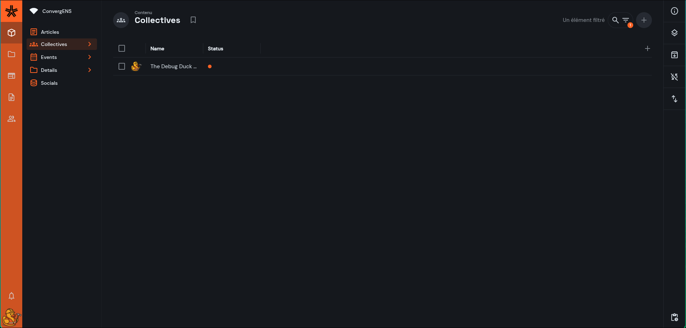

# Documentation Organisateur·ices

Bienvenue 👋  
Ces pages expliquent **comment fonctionne l'éditeur du site**, soit l'interface qui vous permet de **publier/modifier** **du contenu sur le site** (page, articles, événements, …).

<!-- prettier-ignore-start -->
- TOC 
{:toc} 
<!-- prettier-ignore-end -->

# Vue d’ensemble

Il existe **3 espaces** distincts, chacun avec un rôle différent :

1. **Le site web (le “front”)** :  
   [https://convergens.zac.coffee](https://convergens.zac.coffee)  
   C’est la **version publique** visible par tout le monde.  
   On y consulte les pages du site, les articles, les événements, etc.  
   > Vous ne modifiez rien directement ici : tout se fait via l’éditeur.

   

2. **L'Éditeur** :  
   [https://convergensapi.zac.coffee](https://convergensapi.zac.coffee)  
   C’est l’interface “back-office” qui sert à **créer, modifier et publier** le contenu :  
   - organisations (collectives)  
   - articles  
   - événements  
   - tags  
   - liens de réseaux sociaux  
   > C’est ici que vous travaillez pour que le contenu apparaisse ensuite sur le site web.

   

3. **Cette documentation (où vous êtes actuellement)** :  
   [https://zachary-blundell.github.io/ConvergENS/](https://zachary-blundell.github.io/ConvergENS/)  
   C’est le **mode d’emploi** : des explications pas-à-pas pour utiliser l’éditeur, comprendre les champs, et résoudre les problèmes fréquents.  

# Comment utiliser cette documentation ?

- Structure : 
  - "Accueil" : vous êtes dessus !
  - "Comprendre l'éditeur : les bases de ConvergENS" : introduction rapide
  - Puis chacune des 6 sections suivantes correspond à un écran / un formulaire sur l'éditeur du site
  - Une section est ensuite consacrée aux mises à jour
  - Enfin en cliquant sur "ConvergENS éditeur", vous accédez directement à l'éditeur du site et en cliquant sur "ConvergENS site web" vous êtes redirigé.es sur ce qu'on appelle le *front*, c'est-à-dire la partie visible du site.
- Vous pouvez lire la documentation dans l’ordre, ou aller directement à ce dont vous avez besoin.
- Les consignes importantes (visibilité sur le site, droits, ordre de remplissage) sont mises en évidence.

# Besoin d’aide ?

Si malgré cette documentation, vous ne parvenez pas à effectuer la tâche souhaitée, contactez Zachary sur WhatsApp.  
Pour aller plus vite :

- envoyez une **capture d’écran**
- indiquez la page sur laquelle vous êtes en train de travailler
- ce que vous essayez de faire (1 phrase)
