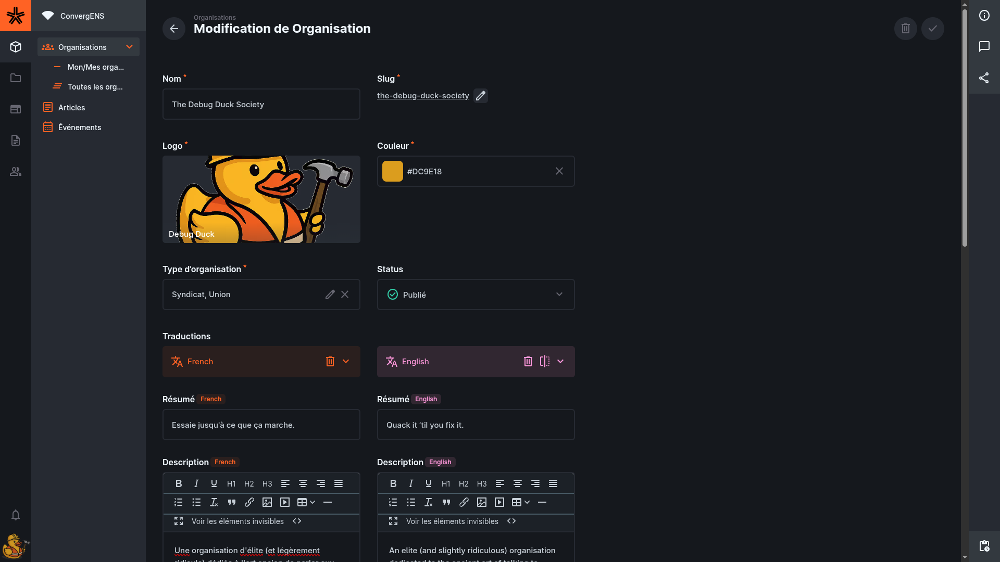
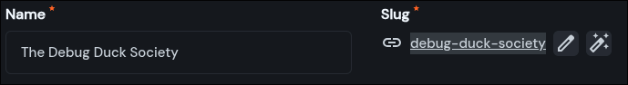
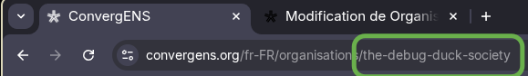
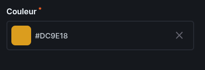
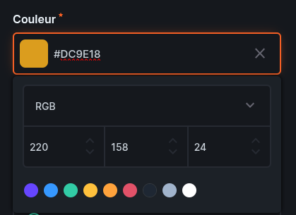
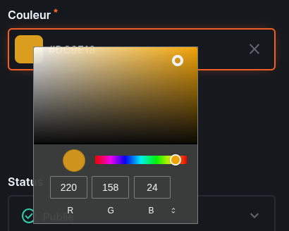
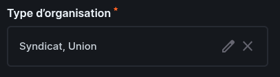
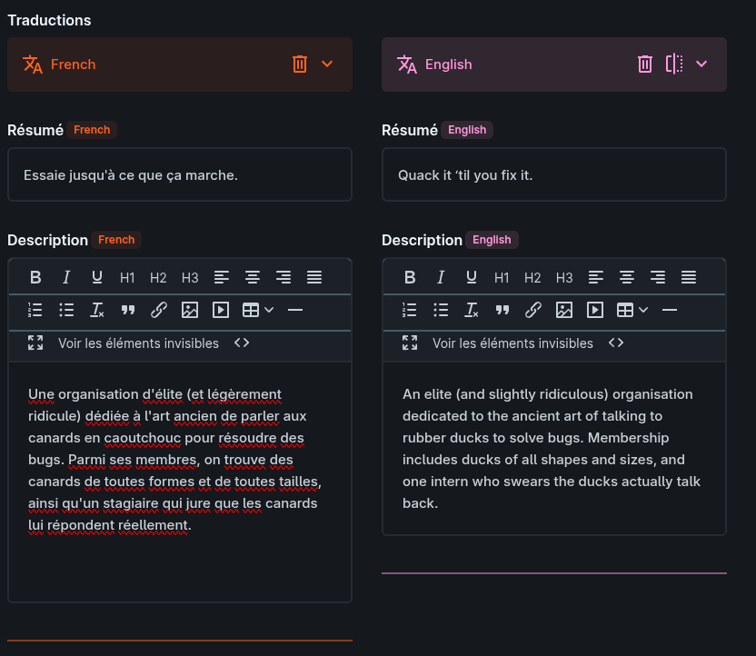
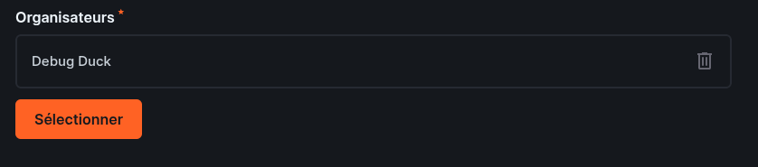
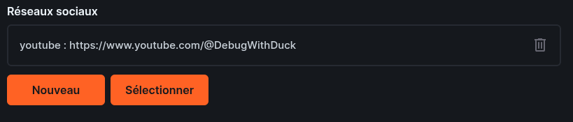

# Organisation (Organisation)

Une **Organisation** (collection `organisations`) représente un groupe associé à ConvergENS.  
Elle sert à afficher une identité publique (nom, logo, couleur, textes), des informations de contact, et des liens vers d’autres éléments (réseaux sociaux, articles, etc.).

<!-- prettier-ignore-start -->

- TOC
{:toc}
<!-- prettier-ignore-end -->

## Où trouver les organisations ?

Dans l'éditeur du site (CMS) : **Contenu → Organisations**.

Selon vos droits et vos filtres, vous verrez soit plusieurs organisations, soit uniquement la vôtre.

👉 En cliquant sur votre organisation, vous ouvrez sa **page** : vous verrez tous les champs et pourrez les mettre à jour.

---

# À remplir en priorité (obligatoire)

✅ = obligatoire

> Objectif : en remplissant cette partie, vous pouvez déjà **enregistrer** et revenir plus tard.

# Identité ✅

## Nom ✅

- **Nom dans l'éditeur du site** : `name`
- **À quoi ça sert** : nom affiché publiquement sur le site.
- **Exemple** : “The Debug Duck Society”

---

## Slug (lien) ✅

- **Nom dans l'éditeur du site** : `slug`
- **À quoi ça sert** : c’est le “nom pour le lien”, utilisé dans l’adresse du site.
  

Un **slug**, c’est le petit texte dans l’adresse (URL) qui identifie une page de façon lisible.

- Il ressemble souvent au nom, mais en version simplifiée : minuscules, sans accents, avec des tirets.
- Il sert à fabriquer l’URL.

Exemple :

- Nom : **"The Debug Duck Society"**
- Slug : **`debug-duck-society`**
- URL : `https://convergens.net/organisations/debug-duck-society`

### Les deux boutons à côté du slug

- ✏️ **Crayon** : modifier le slug à la main

> Conseil : évitez de modifier le slug après publication (cela change le lien).

---

## Logo ✅

- **Nom dans l'éditeur du site** : `logo`
- **À quoi ça sert** : image de l’organisation (logo).
- **Conseil** : privilégiez une image carrée, lisible (idéalement **500×500**).

## Couleur ✅

- **Nom dans l'éditeur du site** : `color`
- **À quoi ça sert** : couleur associée à l’organisation (badges, accents, boutons… sur le site).

### Modifier la couleur

Vous pouvez modifier la couleur associée en saisissant directement un **code hexadécimal** dans le champ texte, par exemple : `#DC9E18`.

- En cliquant dans le **champ texte de couleur**, vous ouvrez le menu `color_text_menu`.
- Ce menu permet de :
  - saisir manuellement une couleur au format hexadécimal ;
  - visualiser et ajuster la couleur via ses valeurs **RGB** ;
  - choisir rapidement une couleur parmi les pastilles proposées.

- En cliquant sur le **carré de couleur** à gauche du champ, vous ouvrez un second menu.
- Ce menu permet de choisir une couleur de façon plus visuelle :
  - en déplaçant le curseur dans la zone de sélection ;
  - en ajustant la teinte avec la barre horizontale ;
  - en affinant la couleur avec les valeurs **R**, **G** et **B**.

- **Conseil** : pour une couleur précise, utilisez le **code hexadécimal** dans le champ texte.
- **Conseil** : pour explorer ou ajuster une teinte visuellement, utilisez le menu du **carré de couleur**.

---

## Type d’organisation ✅

- **Nom dans l'éditeur du site** : `type`
- **À quoi ça sert** : indique la catégorie de l’organisation et détermine **où elle apparaît** sur la page “Organisations” du site.
- **Choix possibles** :
  - **Association**
  - **Parti**
  - **Syndicat**
  - **Club**

> Conseil : choisissez le type qui correspond le mieux.

> Remarque : ne cliquez pas sur le stylo, car cela ouvrirait la page permettant de modifier le type et non de choisir un type. Cliquez directement sur le nom.

---

## Statut ✅

- **Nom dans l'éditeur du site** : `status`
- **À quoi ça sert** : décide si l’organisation est visible sur le site.
- **Valeurs** : `published` / `draft` / `archived`

Bon réflexe :

- laissez en **draft** (brouillon) tant que l’organisation n’est pas prête
- passez en **published** (publié) quand elle doit apparaître sur le site
- utilisez **archived** (archivé) pour la retirer sans la supprimer

---

# Traductions ✅

- **Nom dans l'éditeur du site** : `translations`
- **À quoi ça sert** : textes affichés sur le site, dans chaque langue.

> À savoir :
>
> - **Le français est obligatoire.**
> - **L’anglais est fortement recommandé.**
> - L’interface ouvre le **français par défaut**, donc :
>   1. complétez **FR** en premier,
>   2. puis ajoutez / complétez **EN** si possible.

## Résumé (100 caractères)

- **Nom dans l'éditeur du site** : (dans `translations`) `summary`
- **Où ça s’affiche** : cartes / aperçus (liste des organisations).
- **Objectif** : une phrase simple, très courte.

Exemple :

- “Association étudiante qui organise des débats et des ateliers.”

## Description (page de l’organisation)

- **Nom dans l'éditeur du site** : (dans `translations`) `description`
- **Où ça s’affiche** : page détaillée de l’organisation.
- **Vous pouvez** : titres, gras, listes, liens, images.

➡️ Pour apprendre à utiliser l’éditeur de texte : **[voir le guide de l’éditeur de texte](wysisyg.html)**

> Conseil : mettez l’essentiel dans les premières lignes, puis ajoutez les détails en dessous.

### Astuce “traduction automatique”

> Si vous utilisez DeepL (ou une IA), supprimez les phrases ajoutées automatiquement du type :
>
> - “Voici la traduction : …”
> - “Voici votre texte traduit : …”
> - “Traduction fournie par DeepL”
> - “Translated with DeepL”
> - “Voici une version améliorée / réécrite…”
> - “Bien sûr ! / Avec plaisir !”

---

## Organisateurs (qui gère l’organisation)

**Ceci est à titre informatif et ne doit pas vous inquiéter ni vous préoccuper, car vous n'avez aucun moyen d'y changer quoi que ce soit.**

- **Nom dans l'éditeur du site** : `organisers`
- **À quoi ça sert** : définit qui a accès à cette organisation dans l’éditeur.

> À noter : il peut y avoir **plusieurs** organizers, mais la plupart du temps il n’y en a **qu’un seul** (souvent un compte avec le même nom que l’organisation).  
> On ajoute plusieurs organizers uniquement si une deuxième personne rejoint l’équipe et que vous décidez de gérer l’organisation à deux, ou s’il faut un deuxième compte.

---

# Coordonnées (optionnel)

Ces champs sont facultatifs mais utiles :

## Réseaux sociaux

- **Nom dans l'éditeur du site** : `socials`
- **À quoi ça sert** : ajouter des liens (Instagram, YouTube…).

> Conseil : ajoutez uniquement des liens officiels et vérifiez qu’ils sont publics.

➡️ Pour avoir plus d'informations : **[voir le page](socials.html)**

## Email

- **Nom dans l'éditeur du site** : `email`
- **À quoi ça sert** : contact public.

## Téléphone

- **Nom dans l'éditeur du site** : `phone`
- **À quoi ça sert** : contact public.

## Site web

- **Nom dans l'éditeur du site** : `website`
- **À quoi ça sert** : lien vers le site officiel.
  > Conseil : commencez par `https://`

---

# Procédure pas à pas

1. Aller dans **Contenu → organisations**
2. Ouvrir votre organisation (ou cliquer **Créer** si vous êtes autorisé·e)
3. Remplir en priorité :
   - `name`, `slug`, `logo`, `color`, `type`, `translations`
4. Sauvegarder
5. Passer `status` à **published** quand c’est prêt

---

# Dépannage rapide

## “Je ne vois pas mon organisation”

- Vérifiez que vous êtes dans **Contenu → organisations**
- Vérifiez qu’un **filtre** n’est pas actif
- Selon votre rôle, il est possible que vous ne voyiez **que** certaines organisations (c’est normal)

## “Je ne peux pas changer organizers”

- C’est normal : c’est géré par Zachary (admin). Contactez-le si besoin.

## “Le logo est flou / mal cadré”

- Essayez une image plus grande, idéalement carrée
- Évitez les logos trop détaillés (illisibles en petit)

## “Le lien du site ne marche pas”

- Vérifiez que `website` commence bien par `https://`
