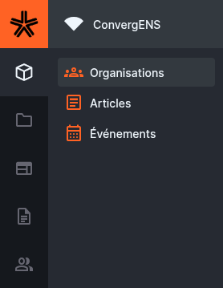

La collection `socials` sert à enregistrer des liens vers les réseaux sociaux (YouTube, Facebook, Twitter, Instagram…) et à les associer à une **organisation** (collection `organisations`).

<!-- prettier-ignore-start -->

- TOC
{:toc}
<!-- prettier-ignore-end -->

## Où trouver les réseaux sociaux ?

Dans Directus : **Contenu → socials**.

> En général, vous n’aurez besoin de cette collection que pour **ajouter / modifier** un lien social.  
> L’affichage public se fait ensuite via l’organisation associée.

---

## Champs

### Type (obligatoire)

- **type** _(obligatoire)_ : plateforme du réseau social  
  Choix disponibles :
  - `youtube` (YouTube)
  - `facebook` (Facebook)
  - `twitter` (Twitter)
  - `instagram` (Instagram)

### URL (obligatoire)

- **url** _(obligatoire, unique)_ : lien vers la page/profil

Une validation empêche les liens invalides : l’URL doit commencer par `http://` ou `https://`.

Exemples valides :

- `https://www.youtube.com/@VotreChaine`
- `https://instagram.com/votreprofil`

### Organisation (obligatoire)

- **organisation** _(obligatoire, M2O → `organisations`)_ : organisation à laquelle appartient ce lien

**Important :** la liste des organisations est **filtrée automatiquement** pour ne montrer que les organisations dont vous êtes **organizer** (via `$CURRENT_USER`).  
Cela évite d’associer un lien social à une organisation à laquelle vous n’êtes pas rattaché·e.

---

## Procédure (création)

1. **Contenu → socials → Créer**
2. Choisir :
   - `type`
   - `url`
   - `organisation` (votre organisation)
3. Enregistrer

---

## Bonnes pratiques

- Ajoutez **un seul lien par plateforme** et par organisation (si possible), pour éviter les doublons.
- Vérifiez que le lien pointe vers la page officielle et qu’il est public.
- Préférez des URLs propres (ex : page / profil) plutôt que des liens temporaires.

---

## Dépannage

### “Je ne vois pas mon organisation dans le champ organisation”

- C’est normal si vous n’êtes pas listé·e dans `organisations.organizers` pour cette organisation.
- Demandez à un admin (ou à un responsable) de vous ajouter comme **organizer** de l’organisation.

### “Je n’arrive pas à enregistrer l’URL”

- Vérifiez que l’URL commence bien par `https://`
- Vérifiez qu’il n’existe pas déjà un item `socials` avec exactement la même URL (le champ est **unique**)
