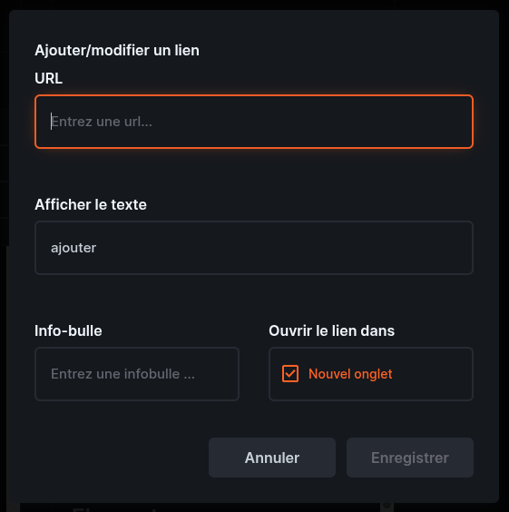

# Utiliser l’éditeur WYSIWYG

L’éditeur WYSIWYG est la zone de texte qui permet d’écrire et de mettre en forme du contenu de manière visuelle. “WYSIWYG” signifie **What You See Is What You Get** : autrement dit, pas besoin d’écrire du code, vous modifiez le texte d’une façon qui ressemble déjà beaucoup au résultat final sur le site.

L’éditeur WYSIWYG est l’espace dans lequel vous pouvez écrire et mettre à jour le contenu qui apparaît sur le site web.  
“WYSIWYG” signifie **What You See Is What You Get**, donc, comme vous l’aurez sans doute deviné, vous n’avez pas besoin de connaissances techniques pour l’utiliser. Cela fonctionne à peu près comme un traitement de texte : vous tapez, vous mettez en forme, vous ajoutez des liens ou des images, puis vous enregistrez vos modifications. Ce guide ne va pas vous faire perdre votre après-midi à expliquer ce que sont le gras et l’italique, mais certaines options méritent quand même un petit détour.

## Ce que vous pouvez faire avec

Avec l’éditeur, vous pouvez :

- écrire et modifier du texte
- utiliser une mise en forme simple comme le gras, l’italique, le souligné et le barré
- utiliser l’indice et l’exposant
- créer des titres et sous-titres avec les [en-têtes](#en-tetes)
- changer l’alignement du texte avec les [options d’alignement](#alignement)
- ajouter des [listes à puces ou numérotées](#listes)
- ajouter et modifier des [liens](#ajouter-un-lien)
- ajouter des [citations en bloc](#elements-de-mise-en-forme-speciaux)
- ajouter et modifier des [images et médias](#images-et-medias)
- créer des [tableaux](#tableaux)
- insérer une [ligne horizontale](#elements-de-mise-en-forme-speciaux)
- utiliser les [outils d’affichage](#outils-daffichage)
- modifier le [code source HTML](#outil-avance)

L’éditeur comprend une barre d’outils avec des boutons pour toutes ces actions, donc dans la plupart des cas quelques clics suffisent.

## En-têtes

Les en-têtes permettent de structurer la page et de la rendre plus facile à lire.

### En-tête 1

C’est le style d’en-tête le plus grand.

À utiliser uniquement pour le titre principal, si nécessaire.

### En-tête 2

C’est un titre de section.

Vous pouvez l’utiliser pour les grandes parties d’une page, par exemple :

- À propos de nous
- Projets
- Événements annuels

### En-tête 3

C’est un titre plus petit.

Il sert pour les sous-sections à l’intérieur d’une section plus grande.

Une bonne règle générale est d’utiliser les en-têtes pour découper les longs blocs de texte afin que les visiteurs trouvent rapidement ce qu’ils cherchent.

## Alignement

L’alignement permet de changer la position du texte sur la page.

### Aligner à gauche

C’est le meilleur choix pour la plupart des contenus, et cela devrait généralement rester l’option par défaut.

### Centrer

À utiliser de temps en temps pour une courte phrase, un titre ou une annonce particulière.

### Aligner à droite

C’est rarement utile pour du contenu web classique.

### Justifier

Cette option aligne le texte à gauche et à droite. Cela peut donner un rendu propre, mais cela peut aussi rendre la lecture un peu moins confortable, donc à utiliser avec modération.

## Listes

Les listes sont très pratiques pour présenter des informations concrètes.

### Liste numérotée

Utilisez une liste numérotée lorsque l’ordre a de l’importance.

Exemple :

1. S’inscrire en ligne
2. Recevoir la confirmation
3. Participer à l’événement

### Liste à puces

Utilisez une liste à puces lorsque l’ordre n’a pas d’importance.

Exemple :

- entrée gratuite
- ouvert aux étudiant·es
- accessible en fauteuil roulant

## Éléments de mise en forme spéciaux

### Citation en bloc

Affiche le texte comme une citation.

À utiliser pour :

- des témoignages
- des citations
- des messages mis en valeur

### Ligne horizontale

Ajoute une ligne horizontale sur la page.

---

Elle permet de séparer clairement différentes sections.

## Ajouter un lien

Lorsque vous cliquez sur **Ajouter/modifier un lien**, une petite fenêtre s’ouvre avec plusieurs champs.

### URL

C’est ici que vous collez l’adresse du lien.

Par exemple :

- un formulaire d’inscription
- une adresse mail
- une autre ressource utile

Vérifiez bien que l’adresse est correcte avant d’enregistrer.

### Afficher le texte

C’est le texte qui apparaîtra sur la page et sur lequel les visiteurs cliqueront.

Par exemple, au lieu d’afficher une adresse longue et peu lisible, il vaut mieux écrire quelque chose de clair comme :

- S’inscrire ici
- Contacter l’organisation

Essayez d’écrire un texte simple et explicite. Cela rend la page plus agréable à lire et évite l’effet “mur de liens incompréhensibles”.

### Info-bulle

Ce champ permet d’ajouter un petit texte d’aide qui peut apparaître au survol du lien.

Ce n’est pas obligatoire. Vous pouvez l’utiliser pour donner une précision courte, mais dans la plupart des cas il peut rester vide. Inutile d’ajouter une info-bulle juste pour le plaisir de remplir une case.

### Ouvrir le lien dans

Vous verrez une option **Nouvel onglet**.

Il est recommandé de **laisser cette case cochée**.

Pourquoi ?

- cela évite que les visiteurs quittent complètement le site
- la page du site reste ouverte dans leur navigateur
- c’est plus pratique pour consulter un réseau social, un formulaire ou un site externe puis revenir ensuite

En général, pour les liens externes, il vaut mieux garder **Nouvel onglet** activé. C’est un petit geste simple qui évite de perdre les visiteurs dans les profondeurs d’Internet.

## Bonnes pratiques

Quand vous ajoutez un lien :

- utilisez un texte clair plutôt que de coller l’adresse brute dans la page
- vérifiez que le lien fonctionne
- laissez **Nouvel onglet** coché pour les sites externes
- évitez d’ajouter trop de liens dans une même phrase

## Images et médias

### Ajouter/modifier une image

Permet d’insérer ou de mettre à jour une image.

À utiliser pour :

- des logos
- des affiches d’événement
- des photos
- des illustrations

Choisissez des images claires, pertinentes et adaptées à la page.

### Ajouter/modifier un média

Permet d’insérer d’autres types de médias.

Selon la configuration, cela peut inclure des vidéos ou du contenu intégré.

À utiliser uniquement lorsque cela apporte une vraie valeur à la page. En d’autres termes : parce que c’est utile, pas juste parce que c’est possible.

## Tableaux

### Tableau

Les tableaux sont faits pour les informations qui ont naturellement leur place en lignes et en colonnes.

Voici de bons usages des tableaux :

- des emplois du temps
- des tableaux comparatifs
- des listes de dates, d’horaires et de lieux
- d’autres données clairement structurées

Exemple :

| Jour  | Heure | Lieu    |
| ----- | ----- | ------- |
| Mardi | 18:00 | Salle A |
| Jeudi | 19:00 | Hall B  |

Merci de **ne pas** utiliser les tableaux pour mettre en page le contenu.

Par exemple, créer une fausse mise en page en deux colonnes avec un tableau peut sembler très joli sur un écran d’ordinateur, mais cela fonctionne souvent beaucoup moins bien sur téléphone. Sur un petit écran, cela peut rendre la page difficile à lire, voire complètement casser la mise en page.

Les tableaux doivent être réservés à de vraies données tabulaires.

Pour la mise en forme générale d’une page, utilisez plutôt :

- des en-têtes
- des paragraphes
- des listes à puces
- des images insérées normalement dans l’éditeur

Cela aidera à garder une page lisible aussi bien sur ordinateur que sur mobile.

## Outils d’affichage

### Plein écran

Agrandit l’éditeur pour qu’il prenne plus de place sur votre écran.

C’est utile lorsque :

- vous rédigez un contenu plus long
- vous relisez une page avec attention
- vous travaillez sur un petit écran

### Afficher les éléments invisibles

Affiche les marques de mise en forme cachées, comme les espaces ou les retours à la ligne.

Cela peut être utile si la mise en page semble étrange et que vous essayez de comprendre pourquoi.

## Outil avancé

### Modifier le code source

Affiche le code HTML derrière le contenu.

La plupart des organisateur·ices n’en auront pas besoin.

Il vaut mieux éviter cette option sauf si quelqu’un vous a explicitement demandé de l’utiliser, ou si vous êtes à l’aise avec le code d’un site web. Pour un usage normal, l’éditeur visuel reste la solution la plus simple et la plus sûre.

# Using the Directus WYSIWYG editor

The Directus WYSIWYG editor is the text box used to write and format content visually. “WYSIWYG” means **What You See Is What You Get**: instead of writing code, you can edit text in a way that looks close to the final result on the website.

The Directus WYSIWYG editor is the space where you can write and update the content that appears on the website.
“WYSIWYG” means **What You See Is What You Get** so as you might image you do not need any technical knowledge to use it. It works a lot like a word processor: you type, format your text, add links or images, and save your changes. This guide wont bore you with what bold and italic are but there are some things that might need some extra explaining.

## What you can do in it

With the editor, you can:

- write and edit text
- use basic formatting such as bold, italic, underline, and strikethrough
- use subscript and superscript
- create titles and subtitles with [headings](#headings)
- change text alignment with [alignment options](#alignment)
- add [bullet-point or numbered lists](#lists)
- add and edit [links](#links)
- add [blockquotes](#special-formatting-elements)
- add and edit [images and media](#images-and-media)
- create [tables](#tables)
- insert a [horizontal rule](#special-formatting-elements)
- use [display tools](#display-tools)
- edit the [HTML source code](#advanced-tool)

The editor includes a toolbar with buttons for these actions, so most changes can be made with simple clicks.

## Headings

Headings help structure the page and make it easier to read.

### Heading 1

The largest heading style.

Use this for the main title only if needed.

### Heading 2

A section title.

Use it for main parts of the page, such as:

- About us
- Projects
- Yearly events

### Heading 3

A smaller section title.

Use it for subsections inside a larger section.

A good rule is to use headings to break up long text so visitors can quickly find what they need.

## Special formatting elements

### Blockquote

Displays text as a quotation.

Use it for:

- testimonials
- quoted statements
- highlighted messages

### Horizontal Rule

Adds a horizontal line across the page.

---

Use it to separate sections clearly.

## Ajouter un lien

Lorsque vous cliquez sur **Ajouter/modifier un lien**, une petite fenêtre s’ouvre avec plusieurs champs.

### URL

C’est ici que vous collez l’adresse du lien.

Par exemple :

- un formulaire d’inscription
- une adresse mail ou une autre ressource utile

Vérifiez bien que l’adresse est correcte avant d’enregistrer.

### Afficher le texte

C’est le texte qui apparaîtra sur la page et sur lequel les visiteurs cliqueront.

Par exemple, au lieu d’afficher une adresse longue et peu lisible, il vaut mieux écrire quelque chose de clair comme :

- S’inscrire ici
- Contacter l’organisation

Essayez d’écrire un texte simple et explicite. Cela rend la page plus agréable à lire.

### Info-bulle

Ce champ permet d’ajouter un petit texte d’aide qui peut apparaître au survol du lien.

Ce n’est pas obligatoire. Vous pouvez l’utiliser pour donner une précision courte, mais dans la plupart des cas il peut rester vide.

### Ouvrir le lien dans

Vous verrez une option **Nouvel onglet**.

Il est recommandé de **laisser cette case cochée**.

Pourquoi ?

- cela évite que les visiteurs quittent complètement le site
- la page du site reste ouverte dans leur navigateur
- c’est plus pratique pour consulter un réseau social, un formulaire ou un site externe puis revenir ensuite

En général, pour les liens externes, il vaut mieux garder **Nouvel onglet** activé.

## Bonnes pratiques

Quand vous ajoutez un lien :

- utilisez un texte clair plutôt que de coller l’adresse brute dans la page
- vérifiez que le lien fonctionne
- laissez **Nouvel onglet** coché pour les sites externes
- évitez d’ajouter trop de liens dans une même phrase

## Images and media

### Add/Edit Image

Lets you insert or update an image.

Use it for:

- logos
- event posters
- photos
- illustrations

Choose images that are clear, relevant, and appropriate for the page.

### Add/Edit Media

Lets you insert other kinds of media.

Depending on the setup, this may include videos or embedded content.

Use it only when it genuinely adds value to the page.

## Tables

### Table

Tables are for information that naturally belongs in rows and columns.

Good uses for tables include:

- timetables
- comparison charts
- lists of dates, times, and locations
- other clearly structured data

Example:

| Day      | Time  | Location |
| -------- | ----- | -------- |
| Tuesday  | 18:00 | Room A   |
| Thursday | 19:00 | Hall B   |

Please do **not** use tables to format the page layout.

For example, using a table to create a two-column design may look fine on a desktop screen, but it often does not work well on mobile phones. On smaller screens, this can make the page harder to read and can break the layout.

Tables should be reserved for real tabular information only.

For general page formatting, use:

- headings
- paragraphs
- bullet lists
- images placed normally in the editor

This will help keep the page readable on both desktop and mobile.

## Display tools

### Full Screen

Makes the editor take up more space on your screen.

This is useful when:

- writing longer content
- reviewing a page carefully
- working on a smaller screen

### View invisible elements

Shows hidden formatting marks such as spaces or paragraph breaks.

This can help when the layout looks odd and you want to understand why.

## Advanced tool

### Edit Source Code

Shows the underlying code behind the content.

Most organizers will not need this.

It is best to avoid this option unless someone has specifically asked you to use it or you are comfortable working with website code. For normal editing, the visual editor is the safest and easiest choice.
